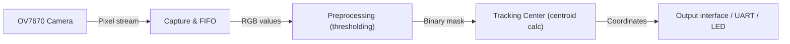

# FPGA Color Tracking

## Overview
FPGA Color Tracking demonstrates real-time color-based object tracking using the OV7670 camera and the Tang Nano 9K FPGA. It includes utilities to convert images into test vectors, simulation testbenches, and notes for deploying on hardware.

## Table of Contents
- Overview
- Requirements
- Quickstart
- System Flow
- Hardware
- Simulation
- Scripts
- Agents (CI & Runners)
- Contributing
- License

## Requirements
- Python 3.7+ (for image conversion scripts)
- ModelSim (or compatible simulator) for RTL simulation
- Tang Nano 9K board and OV7670 camera for hardware tests

## Quickstart
1. Clone the repo and open `FPGA-Color-Tracking-review`.
2. Put input images (PNG/JPG) in `Picture Convertor/input`.

Picture Converter (generate test vectors):

```bash
cd "Picture Convertor"
python image_process.py   # produces image_rgb.txt
```

Restore image from output vectors:

```bash
python restore_image.py  # reads threshold_out.txt or other vector files
```

Run simulation (ModelSim):
- Use `image_rgb.txt` as input for your testbench.
- Compile RTL and testbenches, then run the Tracking Center testbench.

## System Flow


**Description:**
- **Capture**: Read camera pixel stream and buffer frames (PCLK / HREF / VSYNC).
- **Preprocessing**: Convert RGB to chosen color space and apply thresholds to produce a binary mask.
- **Tracking Center**: Compute centroid or bounding box for blobs, filter noise, and output coordinates.
- **Output**: Send coordinates to host, display on LEDs, or interface with actuators.

**Implementation notes:**
- Thresholding can be performed on the FPGA for real-time processing or offline in Python for prototyping.
- Consider simple moving-average or morphological filters to reduce noise before centroid calculation.

## Hardware
- **FPGA**: Tang Nano 9K (pinout mapping available in project documentation)
- **Camera**: OV7670 (connect SIOC, SIOD (I2C), VSYNC, HREF, PCLK, D0-D7 as required)

**Safety notes**: Power the board and camera according to their datasheets. Verify I/O voltage compatibility.

## Simulation
- Use `image_rgb.txt` as stimulus for testbenches.
- **ModelSim workflow**: compile all sources, then `run -all` the testbench for Tracking Center.
- **Expected outputs**: `threshold_out.txt`, logs with detected centroid coordinates.

## Scripts
- `Picture Convertor/image_process.py`: Reads PNG/JPG and outputs `image_rgb.txt` with one pixel per line (R G B).
- `Picture Convertor/restore_image.py`: Reads threshold/output files and reconstructs visual output for inspection.

## Agents (CI & Runners)
This repository includes GitHub Actions workflows for continuous integration and self-hosted runner support:

- **CI (GitHub Actions)**: Automatically run image conversion and basic checks on push/PR using Ubuntu runners.
- **Self-hosted runners**: Required if you need access to physical FPGA hardware or proprietary simulators (e.g., ModelSim with GUI license). Register a runner in your repository settings and set `runs-on: self-hosted` in the workflow.

**Security**: Avoid storing secrets or direct hardware access tokens in public workflows. Use repository secrets and restrict runner access.

## Contributing
Contributions welcome. Open issues or pull requests. For significant changes, create an issue first describing your intent.

## License
This project is provided as-is. Add an appropriate LICENSE file (e.g., MIT) for your use case.
