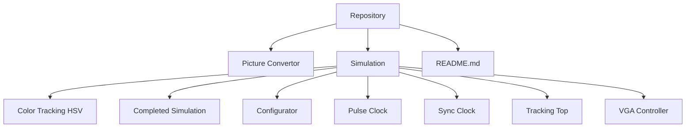
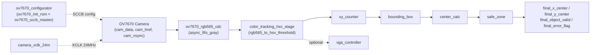
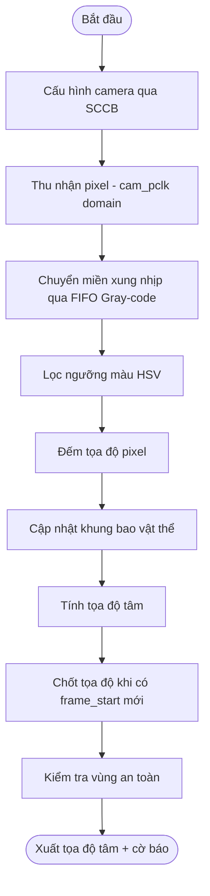
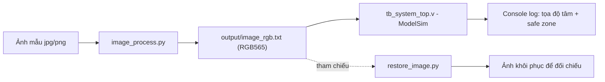

# FPGA Color Tracking

> **Document ID:** 02
> **Project:** FPGA Color Tracking
> **Document Type:** Project Overview & Technical Documentation

---

# 1. Overview

FPGA Color Tracking là hệ thống bám bắt vật thể theo màu (color-based object tracking) thời gian thực, sử dụng camera **OV7670** làm nguồn ảnh và FPGA **Tang Nano 9K** làm lõi xử lý. Hệ thống nhận luồng pixel RGB565 từ camera, lọc theo ngưỡng màu HSV để tách vật thể khỏi nền, sau đó tính toán khung bao (bounding box) và tọa độ tâm vật thể, đồng thời cảnh báo khi vật thể ra khỏi vùng an toàn (Safe Zone) đã định nghĩa.

Repo cũng bao gồm bộ script Python hỗ trợ tạo vector ảnh test (RGB565) để mô phỏng bằng ModelSim và khôi phục ảnh từ dữ liệu mô phỏng để kiểm chứng trực quan.

## Table of Contents
- [1. Overview](#1-overview)
- [2. Repository Structure](#2-repository-structure)
- [3. System Overview](#3-system-overview)
- [4. Module Index](#4-module-index)
- [5. Interface Specifications](#5-interface-specifications)
- [6. Key Parameters](#6-key-parameters)
- [7. System Workflow](#7-system-workflow)
- [8. Simulation](#8-simulation)
- [9. Notes & Known Limitations](#9-notes--known-limitations)
- [10. Conclusion](#10-conclusion)

---

# 2. Repository Structure

```text
FPGA-Color-Tracking
│
├── Picture Convertor/
│   ├── image_process.py        # Chuyển ảnh (jpg/png) -> image_rgb.txt (RGB565)
│   ├── restore_image.py        # Khôi phục ảnh từ file kết quả mô phỏng
│   ├── input/                  # Ảnh mẫu đầu vào
│   ├── output/                 # image_rgb.txt sinh ra cho testbench
│   └── modelsim/
│
├── Simulation/
│   ├── Color Tracking HSV/     # color_tracking_hsv_stage.v, rgb565_to_hsv_threshold.v
│   ├── Completed Simulation/   # Toàn bộ RTL + testbench tích hợp (system_top)
│   ├── Configurator/           # ov7670_configurator.v, ov7670_init_rom.v, ov7670_sccb_master.v
│   ├── Pulse Clock/            # camera_xclk_24m.v
│   ├── Sync Clock/             # async_fifo_gray.v, ov7670_rgb565_cdc.v
│   ├── Tracking Top/           # xy_counter.v, bounding_box.v, center_calc.v, safe_zone.v, tracking_top.v
│   └── VGA Controller/         # VGA_Controller.v
│
└── README.md
```

> **Ghi chú:** Các thư mục con trong `Simulation/` chứa các "lát cắt" module để test độc lập từng khối; thư mục **`Completed Simulation`** chứa bản RTL tích hợp đầy đủ (`system_top.v` + `tb_system_top.v`) dùng để mô phỏng toàn hệ thống.



---

# 3. System Overview

Hệ thống hoạt động theo chuỗi xử lý: **cấu hình camera → thu nhận pixel → chuyển miền xung nhịp → lọc màu HSV → đếm tọa độ & tìm khung bao → tính tâm vật thể → kiểm tra vùng an toàn → (tùy chọn) xuất VGA**.



**Mô tả luồng:**
- **Cấu hình camera:** `ov7670_configurator` nạp bộ giá trị thanh ghi từ `ov7670_init_rom` qua giao thức SCCB (`ov7670_sccb_master`) để thiết lập camera ở chế độ VGA 640x480, RGB565.
- **Thu nhận & CDC:** `ov7670_rgb565_cdc` ghép 2 byte pixel từ `cam_pclk` domain, đẩy qua `async_fifo_gray` (FIFO bất đồng bộ Gray-code) sang `sys_clk` domain, tạo tín hiệu `sys_pixel`, `sys_pixel_valid`, `sys_frame_start`, `sys_line_start`.
- **Lọc màu HSV:** `color_tracking_hsv_stage` gọi `rgb565_to_hsv_threshold` để tách kênh R/G/B từ RGB565, tính H/S/V rồi so ngưỡng, sinh ra `color_mask` (1 nếu pixel thuộc màu mục tiêu).
- **Đếm tọa độ & khung bao:** `xy_counter` đếm vị trí pixel hiện tại trong khung hình; `bounding_box` cập nhật `xmin/xmax/ymin/ymax` khi gặp pixel thuộc vật thể.
- **Tính tâm:** `center_calc` lấy trung bình cộng để ra `x_center`, `y_center`; kết quả được chốt (latch) mỗi khi có `frame_start` mới.
- **Vùng an toàn:** `safe_zone` so tọa độ tâm với vùng an toàn cố định (200x200 pixel ở giữa khung hình), xuất `error_flag` nếu vật thể ra ngoài vùng.
- **VGA (tùy chọn):** `vga_controller` sinh tín hiệu `hsync/vsync` chuẩn 640x480@60Hz để hiển thị; hiện `vga_rgb` đang gán cứng màu đen do chưa có bộ nhớ khung hình.

---

# 4. Module Index

| # | Module | File | Thư mục | Vai trò |
|---|--------|------|---------|---------|
| 1 | system_top | system_top.v | Completed Simulation | Module top cấp cao nhất, kết nối toàn bộ hệ thống |
| 2 | camera_xclk_24m | camera_xclk_24m.v | Pulse Clock | Sinh xung XCLK 24MHz cấp cho camera OV7670 |
| 3 | ov7670_configurator | ov7670_configurator.v | Configurator | Điều khiển quy trình nạp cấu hình camera qua SCCB |
| 4 | ov7670_init_rom | ov7670_init_rom.v | Configurator | ROM chứa danh sách 133 cặp (địa chỉ thanh ghi, giá trị) cấu hình camera VGA/RGB565 |
| 5 | ov7670_sccb_master | ov7670_sccb_master.v | Configurator | Master giao tiếp SCCB/I2C (chỉ ghi) tới camera |
| 6 | ov7670_rgb565_cdc | ov7670_rgb565_cdc.v | Sync Clock | Chuyển đổi byte stream từ `cam_pclk` sang pixel 16-bit ở `sys_clk` |
| 7 | async_fifo_gray | async_fifo_gray.v | Sync Clock | FIFO 2 miền xung nhịp bất đồng bộ (Gray-code pointer) dùng cho CDC |
| 8 | color_tracking_hsv_stage | color_tracking_hsv_stage.v | Color Tracking HSV | Tầng tích hợp: pixel stream → mask màu HSV |
| 9 | rgb565_to_hsv_threshold | rgb565_to_hsv_threshold.v | Color Tracking HSV | Tách kênh RGB565, tính H/S/V và so ngưỡng màu |
| 10 | xy_counter | xy_counter.v | Tracking Top | Đếm tọa độ (x, y) của pixel hiện tại trong khung hình |
| 11 | bounding_box | bounding_box.v | Tracking Top | Theo dõi khung bao (xmin, xmax, ymin, ymax) của vật thể |
| 12 | center_calc | center_calc.v | Tracking Top | Tính tọa độ tâm vật thể từ khung bao |
| 13 | safe_zone | safe_zone.v | Tracking Top | Kiểm tra tâm vật thể có nằm trong vùng an toàn hay không |
| 14 | tracking_top | tracking_top.v | Tracking Top | Module con gộp xy_counter + bounding_box + center_calc + safe_zone |
| 15 | vga_controller | VGA_Controller.v | VGA Controller | Sinh tín hiệu quét VGA 640x480@60Hz |
| 16 | tb_system_top | tb_system_top.v | Completed Simulation | Testbench mô phỏng toàn hệ thống, nạp ảnh test từ file `.txt` |

## 4.1 External Files & Scripts

| # | Filename | Vai trò | Mô tả |
|---|----------|---------|-------|
| 1 | image_process.py | Preprocessing | Đọc ảnh (jpg/png) trong `input/`, resize về 640x480, chuyển sang RGB565 và ghi ra `output/image_rgb.txt` |
| 2 | restore_image.py | Postprocessing | Đọc file dữ liệu kết quả mô phỏng và khôi phục lại thành ảnh để so sánh trực quan |

---

# 5. Interface Specifications

## 5.1 system_top

| # | Gate | Type | Bit-width | Mô tả |
|---|------|------|-----------|-------|
| 1 | sys_clk | Input | 1-bit | Xung nhịp hệ thống (25MHz hoặc 48MHz) |
| 2 | sys_rst | Input | 1-bit | Reset hệ thống (active-high) |
| 3 | cam_xclk | Output | 1-bit | Xung cấp cho camera (24MHz) |
| 4 | cam_sioc | Output | 1-bit | Xung nhịp SCCB/I2C |
| 5 | cam_siod | Inout | 1-bit | Dữ liệu SCCB/I2C |
| 6 | cam_pclk | Input | 1-bit | Xung pixel trả về từ camera |
| 7 | cam_rst | Input | 1-bit | Chân reset camera |
| 8 | cam_vsync | Input | 1-bit | Đồng bộ khung hình (Frame sync) |
| 9 | cam_href | Input | 1-bit | Đồng bộ hàng (Line sync) |
| 10 | cam_data | Input | 8-bit | Dữ liệu pixel từ camera |
| 11 | color_sel | Input | 2-bit | Chọn màu mục tiêu (dự phòng cho mở rộng sau) |
| 12 | final_x_center | Output | 10-bit | Tọa độ X tâm vật thể |
| 13 | final_y_center | Output | 10-bit | Tọa độ Y tâm vật thể |
| 14 | final_object_valid | Output | 1-bit | Báo hiệu đã phát hiện vật thể hợp lệ |
| 15 | final_error_flag | Output | 1-bit | Báo hiệu vật thể ra khỏi vùng an toàn |
| 16 | vga_hsync | Output | 1-bit | Tín hiệu đồng bộ ngang VGA |
| 17 | vga_vsync | Output | 1-bit | Tín hiệu đồng bộ dọc VGA |
| 18 | vga_rgb | Output | 16-bit | Dữ liệu màu RGB565 xuất ra VGA (hiện gán cứng `0`) |

**Parameters:** `IMG_WIDTH = 640`, `IMG_HEIGHT = 480`

## 5.2 ov7670_rgb565_cdc

| # | Gate | Type | Bit-width | Mô tả |
|---|------|------|-----------|-------|
| 1 | cam_pclk | Input | 1-bit | Xung pixel miền camera |
| 2 | cam_rst | Input | 1-bit | Reset miền camera |
| 3 | cam_vsync | Input | 1-bit | Đồng bộ khung hình từ camera |
| 4 | cam_href | Input | 1-bit | Đồng bộ hàng từ camera |
| 5 | cam_data | Input | 8-bit | Byte dữ liệu từ camera |
| 6 | cam_fifo_full | Output | 1-bit | Báo FIFO đầy (miền camera) |
| 7 | cam_overflow_sticky | Output | 1-bit | Cờ tràn FIFO (miền camera, sticky) |
| 8 | sys_clk | Input | 1-bit | Xung nhịp hệ thống |
| 9 | sys_rst | Input | 1-bit | Reset miền hệ thống |
| 10 | sys_rd_en | Input | 1-bit | Cho phép đọc FIFO |
| 11 | sys_pixel | Output | 16-bit | Pixel RGB565 đã đồng bộ về `sys_clk` |
| 12 | sys_pixel_valid | Output | 1-bit | Báo pixel hợp lệ |
| 13 | sys_frame_start | Output | 1-bit | Báo bắt đầu khung hình mới |
| 14 | sys_line_start | Output | 1-bit | Báo bắt đầu hàng mới |
| 15 | sys_fifo_empty | Output | 1-bit | Báo FIFO rỗng (miền hệ thống) |
| 16 | sys_overflow_sticky | Output | 1-bit | Cờ tràn FIFO (miền hệ thống, sticky) |

**Parameters:** `FIFO_ADDR_WIDTH` (mặc định 5, `system_top` dùng 10), `VSYNC_ACTIVE_HIGH`

## 5.3 async_fifo_gray

| # | Gate | Type | Bit-width | Mô tả |
|---|------|------|-----------|-------|
| 1 | wr_clk / wr_rst | Input | 1-bit | Xung nhịp & reset miền ghi |
| 2 | wr_en | Input | 1-bit | Cho phép ghi |
| 3 | wr_data | Input | DATA_WIDTH-bit | Dữ liệu ghi vào FIFO |
| 4 | wr_full | Output | 1-bit | FIFO đầy |
| 5 | wr_overflow | Output | 1-bit | Cờ tràn khi ghi |
| 6 | rd_clk / rd_rst | Input | 1-bit | Xung nhịp & reset miền đọc |
| 7 | rd_en | Input | 1-bit | Cho phép đọc |
| 8 | rd_data | Output | DATA_WIDTH-bit | Dữ liệu đọc ra |
| 9 | rd_empty | Output | 1-bit | FIFO rỗng |
| 10 | rd_underflow | Output | 1-bit | Cờ cạn khi đọc |

**Parameters:** `DATA_WIDTH = 18` (mặc định), `ADDR_WIDTH = 4` (mặc định) — con trỏ đọc/ghi truyền chéo miền dưới dạng Gray code qua 2 tầng flip-flop để tránh metastability.

## 5.4 rgb565_to_hsv_threshold

| # | Gate | Type | Bit-width | Mô tả |
|---|------|------|-----------|-------|
| 1 | clk | Input | 1-bit | Xung nhịp hệ thống |
| 2 | rst | Input | 1-bit | Reset (active-high) |
| 3 | rgb565 | Input | 16-bit | Pixel đầu vào định dạng RGB565 |
| 4 | pixel_valid | Input | 1-bit | Báo pixel đầu vào hợp lệ |
| 5 | hue | Output | 8-bit | Giá trị Hue tính được |
| 6 | sat | Output | 8-bit | Giá trị Saturation tính được |
| 7 | val | Output | 8-bit | Giá trị Value (độ sáng) tính được |
| 8 | mask | Output | 1-bit | `1` nếu pixel nằm trong ngưỡng màu mục tiêu |
| 9 | mask_valid | Output | 1-bit | Báo kết quả `mask` hợp lệ |

**Parameters:** `H_MIN/H_MAX`, `S_MIN/S_MAX`, `V_MIN/V_MAX` — ngưỡng màu HSV để xác định vật thể mục tiêu.

## 5.5 xy_counter

| # | Gate | Type | Bit-width | Mô tả |
|---|------|------|-----------|-------|
| 1 | clk | Input | 1-bit | Xung nhịp hệ thống |
| 2 | rst | Input | 1-bit | Reset (active-high) |
| 3 | pixel_valid | Input | 1-bit | Xung nhịp đếm (mỗi pixel hợp lệ) |
| 4 | frame_start | Input | 1-bit | Reset bộ đếm về (0,0) khi có khung hình mới |
| 5 | x_cnt | Output | 10-bit | Tọa độ X hiện tại (0–639) |
| 6 | y_cnt | Output | 10-bit | Tọa độ Y hiện tại (0–479) |

## 5.6 bounding_box

| # | Gate | Type | Bit-width | Mô tả |
|---|------|------|-----------|-------|
| 1 | clk / rst | Input | 1-bit | Xung nhịp & reset |
| 2 | frame_start | Input | 1-bit | Reset khung bao về giá trị biên khi bắt đầu khung mới |
| 3 | pixel_valid | Input | 1-bit | Báo pixel hợp lệ |
| 4 | object_pixel | Input | 1-bit | Pixel hiện tại có thuộc vật thể hay không (= `mask`) |
| 5 | x_cnt, y_cnt | Input | 10-bit | Tọa độ pixel hiện tại |
| 6 | xmin, xmax, ymin, ymax | Output | 10-bit | Tọa độ biên khung bao vật thể |

## 5.7 center_calc

| # | Gate | Type | Bit-width | Mô tả |
|---|------|------|-----------|-------|
| 1 | xmin, xmax, ymin, ymax | Input | 10-bit | Tọa độ khung bao |
| 2 | x_center, y_center | Output | 10-bit | Tọa độ tâm = trung bình cộng (`(min+max)>>1`) |

## 5.8 safe_zone

| # | Gate | Type | Bit-width | Mô tả |
|---|------|------|-----------|-------|
| 1 | x_center, y_center | Input | 10-bit | Tọa độ tâm vật thể |
| 2 | error_flag | Output | 1-bit | `1` nếu tâm nằm ngoài vùng an toàn 200x200 pixel ở giữa khung hình (x: 220–420, y: 140–340) |

## 5.9 ov7670_configurator

| # | Gate | Type | Bit-width | Mô tả |
|---|------|------|-----------|-------|
| 1 | clk / rst | Input | 1-bit | Xung nhịp & reset |
| 2 | sioc | Output | 1-bit | Xung nhịp SCCB |
| 3 | siod | Inout | 1-bit | Dữ liệu SCCB |
| 4 | config_done | Output | 1-bit | Báo đã nạp xong toàn bộ cấu hình |
| 5 | config_busy | Output | 1-bit | Báo đang trong quá trình nạp |
| 6 | ack_error_sticky | Output | 1-bit | Cờ báo lỗi ACK (sticky) |
| 7 | rom_index_debug | Output | 8-bit | Chỉ số bản ghi ROM hiện tại (phục vụ debug) |

**Parameters:** `CLK_HZ`, `SCCB_HZ`, `STARTUP_DELAY_CYCLES`, `INTER_WRITE_DELAY_CYCLES`, `RESET_DELAY_CYCLES`

## 5.10 vga_controller

| # | Gate | Type | Bit-width | Mô tả |
|---|------|------|-----------|-------|
| 1 | vga_clk | Input | 1-bit | Xung nhịp VGA (chuẩn 25.175MHz cho 640x480) |
| 2 | rst | Input | 1-bit | Reset (active-high) |
| 3 | vga_hsync | Output | 1-bit | Tín hiệu đồng bộ ngang |
| 4 | vga_vsync | Output | 1-bit | Tín hiệu đồng bộ dọc |
| 5 | vga_blank | Output | 1-bit | Báo vùng blank (ngang/dọc) |
| 6 | pixel_x, pixel_y | Output | 11-bit | Tọa độ quét hiện tại trên màn hình |

---

# 6. Key Parameters

| Tham số | Module | Giá trị mặc định | Ý nghĩa |
|---------|--------|-------------------|---------|
| IMG_WIDTH / IMG_HEIGHT | system_top, tb_system_top | 640 / 480 | Độ phân giải khung hình chuẩn VGA |
| CLK_IN_HZ | camera_xclk_24m | 48,000,000 | Xung nhịp đầu vào để chia ra XCLK 24MHz cho camera |
| CLK_HZ / SCCB_HZ | ov7670_configurator | 48,000,000 / 100,000 | Xung hệ thống và tốc độ SCCB khi cấu hình camera |
| H_MIN/H_MAX, S_MIN/S_MAX, V_MIN/V_MAX | rgb565_to_hsv_threshold | H: 0–10, S: 80–255, V: 50–255 | Ngưỡng màu HSV mặc định để nhận diện vật thể (tông đỏ) |
| FIFO_ADDR_WIDTH | ov7670_rgb565_cdc | 5 (mặc định) / 10 (dùng trong system_top) | Độ sâu FIFO CDC, tăng lên khi mô phỏng để tránh tràn |
| Safe Zone bounds | safe_zone | x: 220–420, y: 140–340 | Vùng an toàn 200x200 pixel ở giữa khung hình |

---

# 7. System Workflow

## 7.1 Configuration Stage

- `camera_xclk_24m` cấp xung 24MHz cho camera OV7670 (chia đôi từ `sys_clk` 48MHz, hoặc pass-through nếu `sys_clk` đã là 24MHz).
- `ov7670_configurator` đọc tuần tự 133 cặp (địa chỉ thanh ghi, giá trị) từ `ov7670_init_rom`, gửi từng cặp qua `ov7670_sccb_master` (giao thức SCCB/I2C, địa chỉ ghi `8'h42`) để đưa camera vào chế độ VGA 640x480, RGB565, tắt scaling.
- Cờ `config_done` báo khi toàn bộ 133 lệnh đã được ghi xong.

## 7.2 Capture & Clock Domain Crossing

- Camera xuất pixel theo miền `cam_pclk`; `ov7670_rgb565_cdc` ghép 2 byte liên tiếp thành 1 pixel RGB565 16-bit, gắn thêm cờ `frame_start`/`line_start`, rồi ghi vào `async_fifo_gray`.
- `async_fifo_gray` dùng con trỏ Gray-code truyền qua 2 tầng flip-flop để đưa dữ liệu an toàn sang miền `sys_clk`, tránh lỗi metastability giữa 2 domain không liên quan.

## 7.3 HSV Color Filtering

- `color_tracking_hsv_stage` nhận `sys_pixel` hợp lệ, gọi `rgb565_to_hsv_threshold` để tách kênh R8/G8/B8 từ RGB565, tính toán Max/Min/Delta theo pipeline, suy ra H/S/V rồi so với ngưỡng cấu hình để xuất `color_mask`.

## 7.4 Tracking (XY Counter → Bounding Box → Center)

- `xy_counter` đếm tọa độ (x, y) theo từng pixel hợp lệ, reset về (0,0) khi có `frame_start` mới.
- `bounding_box` mở rộng dần khung bao (`xmin/xmax/ymin/ymax`) mỗi khi gặp pixel có `object_pixel = 1`.
- `center_calc` tính tọa độ tâm = trung bình cộng của khung bao.
- `system_top` chốt (latch) tọa độ tâm cuối cùng vào thanh ghi mỗi khi có `frame_start` mới, đồng thời đặt cờ `final_object_valid` nếu khung bao hợp lệ (`xmax >= xmin`, `ymax >= ymin`, `xmax != 0`).

## 7.5 Safe Zone Check & Output

- `safe_zone` so tọa độ tâm đã chốt với vùng an toàn 200x200 pixel (x: 220–420, y: 140–340); nếu nằm ngoài, `final_error_flag` được kích hoạt.
- Kết quả cuối cùng (`final_x_center`, `final_y_center`, `final_object_valid`, `final_error_flag`) được xuất ra ngoài `system_top` để phục vụ hiển thị hoặc điều khiển tiếp theo.

## 7.6 VGA Output (Optional)

- `vga_controller` sinh tín hiệu `hsync`/`vsync` chuẩn 640x480@60Hz và tọa độ quét `pixel_x`/`pixel_y`; hiện tại `vga_rgb` được gán cứng giá trị `0` (màu đen) do hệ thống chưa tích hợp bộ nhớ khung hình để hiển thị ảnh đã xử lý.



---

# 8. Simulation

## 8.1 Testbench Workflow (`tb_system_top.v`)

1. Khởi tạo `sys_clk` (50MHz, chu kỳ 20ns) và `cam_pclk` (~24MHz, chu kỳ ~41.6ns).
2. Đọc file `input/image_rgb.txt` (định dạng hex, mỗi dòng 1 pixel RGB565) vào mảng nhớ `image_mem` bằng `$readmemh`. File này cần đủ `640 x 480 = 307200` dòng.
3. Sau khi nhả reset, testbench tạo 1 khung hình (Frame 1): với mỗi pixel, kéo `cam_href = 1` và đẩy lần lượt byte cao rồi byte thấp của pixel qua `cam_data` theo từng cạnh xuống của `cam_pclk`.
4. Tạo thêm Frame 2 (rút gọn) chỉ để phát tín hiệu `frame_start` mới, giúp chốt (latch) tọa độ tâm đã tính từ Frame 1 ra các cổng `final_*`.
5. In kết quả ra console: tọa độ tâm (`final_x_center`, `final_y_center`) và trạng thái an toàn (`final_error_flag`) nếu `final_object_valid = 1`; nếu không, báo "KHÔNG TÌM THẤY VẬT THỂ".

## 8.2 Picture Convertor Scripts

- **`image_process.py`**: đọc ảnh mẫu (jpg/png) trong `Picture Convertor/input/`, resize về đúng 640x480, chuyển từng pixel sang RGB565 và ghi ra `Picture Convertor/output/image_rgb.txt` — chính là file được `tb_system_top.v` đọc vào.
- **`restore_image.py`**: đọc lại dữ liệu kết quả mô phỏng (hoặc dữ liệu ảnh RGB565) để dựng thành ảnh hiển thị được, phục vụ kiểm chứng trực quan.



---

# 9. Notes & Known Limitations

- `vga_rgb` trong `system_top` hiện đang gán cứng `16'h0000` (đen) vì hệ thống chưa có bộ nhớ khung hình (frame buffer) để lưu và xuất ảnh đã xử lý lên VGA — đây là phần "tùy chọn hiển thị sau này" theo comment trong code.
- `camera_xclk_24m` chỉ hỗ trợ `CLK_IN_HZ = 24 MHz` (pass-through) hoặc `48 MHz` (chia 2); nếu board thực tế dùng clock khác (ví dụ Tang Nano 9K 27MHz), cần thêm Gowin PLL để tạo ra 24MHz hoặc 48MHz trước khi đưa vào module này.
- `color_sel` ở cổng `system_top` hiện chưa được sử dụng trong logic xử lý — được để dự phòng cho việc chọn màu mục tiêu động trong tương lai (hiện ngưỡng HSV đang cố định qua parameter).
- Cổng `ack_error_sticky` của `ov7670_sccb_master`/`ov7670_configurator` chỉ mang tính cảnh báo (sticky flag), không tự động retry khi cấu hình camera thất bại.
- `FIFO_ADDR_WIDTH` được tăng lên 10 (thay vì mặc định 5) trong `system_top` để tăng độ sâu FIFO, tránh tràn dữ liệu khi mô phỏng.
- Testbench cần file `input/image_rgb.txt` có đúng 307,200 dòng (640x480); nếu thiếu, `$readmemh` sẽ đọc không đủ dữ liệu hoặc lỗi mô phỏng.

---

# 10. Conclusion

Hệ thống FPGA Color Tracking hiện thực hóa đầy đủ một pipeline bám bắt vật thể theo màu thời gian thực: từ cấu hình camera, thu nhận và đồng bộ hóa dữ liệu qua CDC, lọc ngưỡng màu HSV, đến tính toán khung bao, tọa độ tâm và kiểm tra vùng an toàn. Kiến trúc module hóa rõ ràng (mỗi khối RTL đảm nhiệm một chức năng độc lập, có thể mô phỏng riêng lẻ trong các thư mục `Simulation/*`) giúp thuận tiện cho việc kiểm thử từng phần trước khi tích hợp toàn hệ thống qua `system_top.v`. Phần xuất hình ảnh qua VGA hiện còn là hướng phát triển tiếp theo, cần bổ sung bộ nhớ khung hình để hiển thị kết quả xử lý trực quan trên màn hình thực tế.

---

**End of Documentation**
