# FPGA Color Tracking

> **Project Overview**  
> Version: 1.0  
> Documentation Level: Overview  
> Repository: FPGA-Color-Tracking

---

# 1. Introduction

## 1.1 Project Background

FPGA Color Tracking is a hardware-based image processing project implemented on the Tang Nano 9K FPGA development board. The system captures image data from an OV7670 camera, processes the incoming RGB565 pixel stream, detects the target color using an HSV threshold algorithm, and generates tracking information for real-time display.

The repository contains RTL modules, simulation projects, and Python utilities required for image preprocessing, simulation, and image restoration.

---

## 1.2 Project Objectives

The project is designed with the following objectives:

- Implement a real-time FPGA image processing system.
- Capture RGB565 image data from the OV7670 camera.
- Detect target colors using HSV threshold processing.
- Calculate object position information.
- Generate object tracking results.
- Display processed images through the VGA interface.
- Verify hardware functionality using RTL simulation.
- Support simulation through Python preprocessing utilities.

---

# 2. Feature Highlights

| Feature | Description |
|----------|-------------|
| Camera Interface | Capture RGB565 image data from OV7670 |
| Camera Configuration | Automatic OV7670 initialization |
| Clock Synchronization | Safe transfer between clock domains |
| HSV Processing | Pixel-level color detection |
| Object Tracking | Real-time tracking pipeline |
| Center Calculation | Calculate detected object center |
| Bounding Box | Generate object boundary |
| Safe Zone | Determine target position relative to monitoring region |
| VGA Display | Display processed video output |
| RTL Simulation | Functional verification |
| Python Utilities | Image preprocessing and restoration |

---

# 3. Hardware Platform

| Component | Description |
|-----------|-------------|
| FPGA Board | Tang Nano 9K |
| Camera | OV7670 |
| Display | VGA |
| Programming Language | Verilog HDL |
| Utility Language | Python |

---

# 4. Software Components

The repository consists of several software components supporting hardware development and verification.

| Component | Purpose |
|-----------|---------|
| Verilog RTL | Hardware implementation |
| Python Scripts | Image conversion and restoration |
| Simulation Projects | RTL functional verification |

---

# 5. Repository Structure

```text
FPGA-Color-Tracking
│
├── Picture Convertor
│   ├── image_process.py
│   ├── restore_image.py
│   ├── input/
│   ├── output/
│   └── modelsim/
│
├── Simulation
│   ├── Color Tracking HSV
│   ├── Completed Simulation
│   ├── Configurator
│   ├── Pulse Clock
│   ├── Sync Clock
│   └── Tracking Center
│
└── README.md
```

---

# 6. Development Workflow

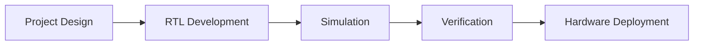

---

# 7. Overall System Workflow

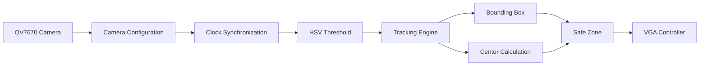

---

# 8. Processing Pipeline

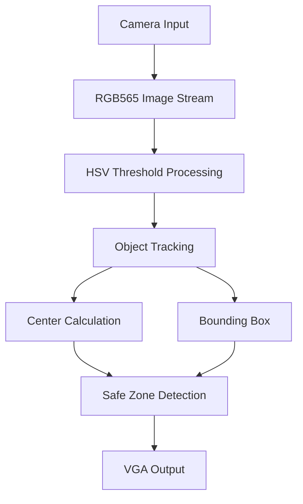

---

# 9. Repository Organization

The project is divided into independent functional groups.

| Directory | Purpose |
|------------|---------|
| Picture Convertor | Image preprocessing and restoration |
| Simulation | RTL simulation projects |
| README.md | Repository documentation |

---

# 10. Project Scope

## Included

- FPGA RTL implementation
- Camera configuration
- RGB565 image processing
- HSV threshold processing
- Object tracking
- Center calculation
- Bounding box generation
- Safe-zone detection
- VGA display controller
- Python preprocessing utilities
- RTL simulation

---

## Repository Workflow

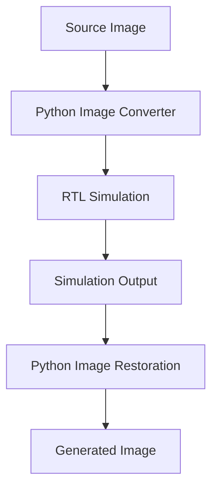

---

# 11. Documentation Roadmap

```mermaid
flowchart LR

Overview["01 Project Overview"]

Architecture["02 System Architecture"]

Modules["03 Module Architecture"]

Interface["04 Interface Specification"]

Simulation["05 Simulation Guide"]

Verification["06 Verification"]

Hardware["07 Hardware Setup"]

Developer["08 Developer Guide"]

Overview --> Architecture

Architecture --> Modules

Modules --> Interface

Interface --> Simulation

Simulation --> Verification

Verification --> Hardware

Hardware --> Developer
```

---

# 12. Summary

FPGA Color Tracking is organized as a modular FPGA image-processing system consisting of camera initialization, image acquisition, clock synchronization, HSV-based color detection, object tracking, VGA display output, RTL simulation, and Python image-processing utilities. The modular architecture enables independent verification of each subsystem while supporting complete system integration.

---
**Next Document**

# System Architecture

> **Document ID:** 02  
> **Project:** FPGA Color Tracking  
> **Document Type:** System Architecture

---

# 1. Architecture Overview

The FPGA Color Tracking system is designed as a modular streaming image-processing architecture. Each subsystem performs an independent hardware function and forwards its output to the next processing stage. The complete architecture is divided into dedicated functional blocks responsible for camera initialization, image acquisition, synchronization, color detection, object tracking, and VGA display.

---

# 2. Top-Level System Architecture

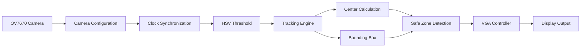

---

# 3. Architecture Layers

The system is organized into multiple processing layers.

| Layer | Function |
|--------|----------|
| Input Layer | Camera image acquisition |
| Configuration Layer | Camera initialization |
| Synchronization Layer | Clock-domain crossing |
| Processing Layer | HSV color detection |
| Tracking Layer | Object tracking |
| Output Layer | VGA display |

---

# 4. Hardware Architecture

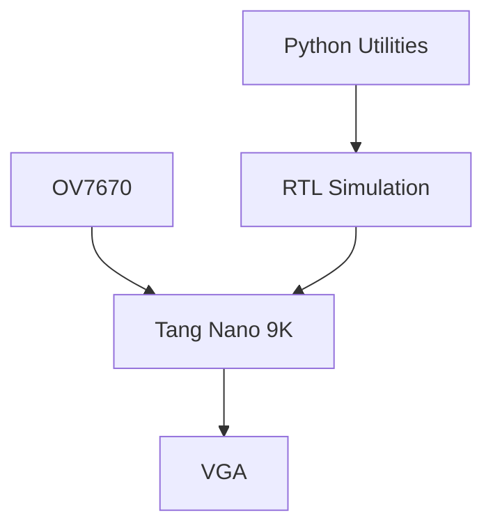

---

# 5. Camera Subsystem

## Purpose

The camera subsystem initializes the OV7670 and continuously acquires RGB565 image data.

---

### Components

| Module | Function |
|----------|----------|
| Camera Configuration | Configure camera registers |
| SCCB Master | Camera communication |
| Initialization ROM | Register storage |
| Camera Clock | Camera clock generation |

---

### Camera Architecture

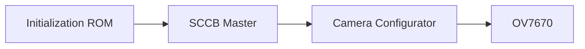

---

# 6. Clock Architecture

The project separates camera timing from processing timing through synchronization logic.


---

# 7. Image Processing Architecture

The image-processing subsystem performs pixel-by-pixel color detection.


---

### Processing Description

| Stage | Function |
|---------|----------|
| RGB565 Input | Receive image pixel |
| HSV Processing | Convert to threshold result |
| Binary Mask | Generate tracking pixels |

---

# 8. Tracking Architecture

The tracking subsystem receives the binary detection result and calculates object information.

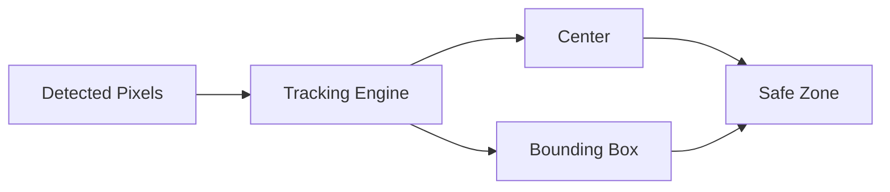

---

### Tracking Components

| Module | Description |
|----------|-------------|
| Tracking Engine | Object tracking |
| Center Calculation | Calculate object center |
| Bounding Box | Generate object boundary |
| Safe Zone | Evaluate tracking area |

---

# 9. VGA Architecture

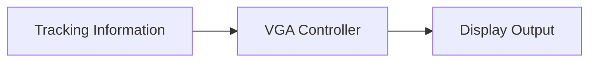

---

# 10. Data Flow

```mermaid
flowchart LR

Camera

--> RGB565

--> Synchronization

--> HSV

--> Tracking

--> Bounding Box

--> Center

--> Safe Zone

--> VGA
```

---

# 11. Processing Pipeline

| Step | Description |
|--------|-------------|
| 1 | Camera captures image |
| 2 | RGB565 data generated |
| 3 | Synchronization |
| 4 | HSV threshold processing |
| 5 | Tracking |
| 6 | Center calculation |
| 7 | Bounding box generation |
| 8 | Safe-zone evaluation |
| 9 | VGA output |

---

# 12. Functional Blocks

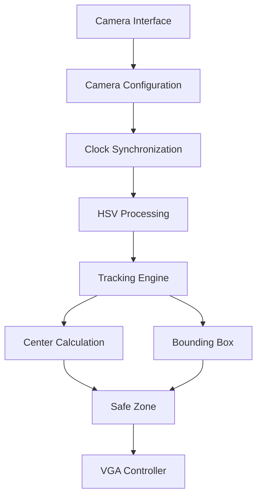

---

# 13. Module Dependency

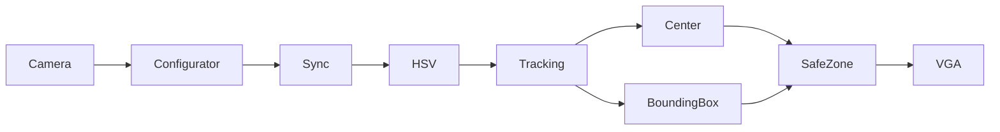

---

# 14. Clock Domain Overview

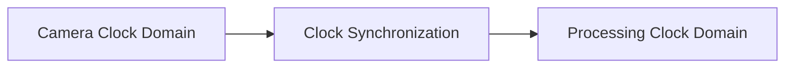

---

# 15. Repository Mapping

| Directory | Architecture Component |
|------------|------------------------|
| Picture Convertor | Image preprocessing |
| Simulation | RTL verification |
| Color Tracking HSV | HSV subsystem |
| Tracking Center | Tracking subsystem |
| Configurator | Camera subsystem |
| Sync Clock | Synchronization subsystem |
| Pulse Clock | Clock subsystem |
| Completed Simulation | Complete architecture |

---

# 16. Complete System Flow

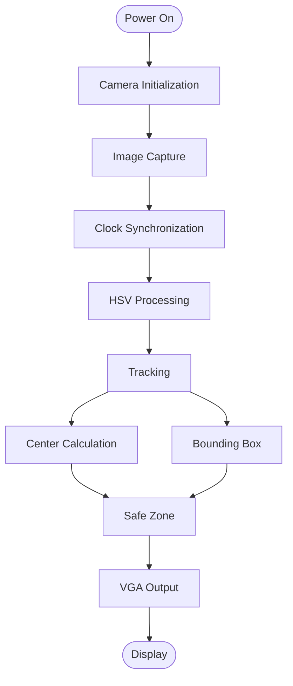

---

# 17. Architecture Summary

The FPGA Color Tracking system follows a modular hardware architecture consisting of dedicated camera, synchronization, image-processing, object-tracking, and display subsystems. Each subsystem operates independently and exchanges data through a continuous streaming pipeline, enabling functional verification of individual modules and complete system integration.

---

**Next Document**

# Module Architecture

> **Document ID:** 03  
> **Project:** FPGA Color Tracking  
> **Document Type:** Module Architecture

---

# 1. Overview

This document describes the hardware modules used in the FPGA Color Tracking project. Each module is implemented as an independent RTL component with a dedicated responsibility inside the complete image-processing pipeline.

---

# 2. Module Hierarchy

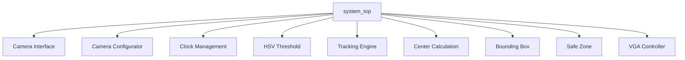

---

# 3. Module Relationship

```mermaid
flowchart LR

Camera

-->

Configurator

-->

Clock Sync

-->

HSV

-->

Tracking

--> Center

Tracking

--> Bounding Box

Center --> Safe Zone

Bounding Box --> Safe Zone

Safe Zone --> VGA
```

---

# 4. Camera Interface

## Purpose

Acquire image data from the OV7670 camera.

---

### Position in System

```mermaid
flowchart LR

OV7670

-->

Camera Interface

-->

RGB565 Stream
```

---

### Inputs

| Signal Type | Description |
|-------------|-------------|
| Camera Data | Image pixels |
| Camera Clock | Pixel clock |
| Synchronization | Frame synchronization |

---

### Outputs

| Signal Type | Description |
|-------------|-------------|
| RGB565 | Pixel stream |

---

### Related Modules

- Camera Configurator
- Clock Synchronization

---

# 5. Camera Configurator

## Purpose

Configure the OV7670 camera before image acquisition.

---

### Architecture

```mermaid
flowchart LR

ROM

-->

SCCB Master

-->

Configurator

-->

OV7670
```

---

### Functional Description

The configurator loads camera register values from initialization memory and transfers them to the OV7670 through the SCCB interface.

---

### Related Modules

- Initialization ROM
- SCCB Master
- Camera Interface

---

# 6. Clock Synchronization

## Purpose

Synchronize image data between camera timing and processing logic.

---

### Architecture

```mermaid
flowchart LR

Camera Clock

-->

Synchronization

-->

Processing Clock
```

---

### Data Flow

| Stage | Description |
|---------|-------------|
| Camera Clock | Input timing |
| Synchronization | Clock-domain crossing |
| Processing Clock | Internal logic timing |

---

# 7. HSV Threshold Module

## Purpose

Detect pixels that satisfy the configured HSV threshold.

---

### Processing Flow

```mermaid
flowchart LR

RGB565

-->

HSV Threshold

-->

Binary Detection
```

---

### Functional Description

Each incoming RGB565 pixel is evaluated by the HSV threshold logic to determine whether it belongs to the target color.

---

### Inputs

| Category | Description |
|-----------|-------------|
| RGB565 Pixel | Image input |

---

### Outputs

| Category | Description |
|-----------|-------------|
| Detection Result | Binary pixel |

---

# 8. Tracking Engine

## Purpose

Receive detected pixels and generate tracking information.

---

### Architecture

```mermaid
flowchart LR

Detected Pixels

-->

Tracking Engine

-->

Tracking Result
```

---

### Internal Connections

```mermaid
graph LR

Tracking

--> Center

Tracking

--> Bounding Box
```

---

### Related Modules

- Center Calculation
- Bounding Box

---

# 9. Center Calculation

## Purpose

Calculate the center position of the detected object.

---

### Architecture

```mermaid
flowchart TD

Detected Pixels

-->

Accumulation

-->

Center Position
```

---

### Outputs

| Output | Description |
|----------|-------------|
| Center Position | Object center |

---

# 10. Bounding Box

## Purpose

Generate the minimum boundary enclosing detected pixels.

---

### Architecture

```mermaid
flowchart TD

Detected Pixels

-->

Boundary Calculation

-->

Bounding Box
```

---

### Outputs

| Output | Description |
|----------|-------------|
| Bounding Box | Object boundary |

---

# 11. Safe Zone

## Purpose

Determine whether the tracked object is located inside the monitoring area.

---

### Architecture

```mermaid
flowchart LR

Center Position

-->

Safe Zone

Bounding Box

-->

Safe Zone

Safe Zone

-->

Decision
```

---

### Processing

| Input | Function |
|---------|----------|
| Center | Position evaluation |
| Bounding Box | Region evaluation |

---

### Output

Safe-zone decision.

---

# 12. VGA Controller

## Purpose

Generate VGA timing and display processed images.

---

### Architecture

```mermaid
flowchart LR

Tracking Result

-->

VGA Controller

-->

Display
```

---

### Related Modules

- Tracking Engine
- Safe Zone

---

# 13. Python Utilities

## Purpose

Support simulation through image preprocessing and restoration.

---

### Workflow

```mermaid
flowchart LR

Input Image

-->

Image Conversion

-->

Simulation

-->

Image Restoration
```

---

### Components

| Utility | Purpose |
|----------|----------|
| Image Converter | Prepare simulation image |
| Image Restoration | Restore generated image |

---

# 14. Simulation Modules

Simulation projects are organized according to subsystem functionality.

| Simulation | Target Module |
|-------------|---------------|
| Color Tracking HSV | HSV subsystem |
| Configurator | Camera configuration |
| Pulse Clock | Clock generation |
| Sync Clock | Clock synchronization |
| Tracking Center | Tracking subsystem |
| Completed Simulation | Complete system |

---

# 15. Complete Module Pipeline

```mermaid
flowchart LR

Camera

-->

Configurator

-->

Clock Sync

-->

HSV Threshold

-->

Tracking

--> Center

Tracking

--> Bounding Box

Center

-->

Safe Zone

Bounding Box

-->

Safe Zone

Safe Zone

-->

VGA Controller

-->

Display
```

---

# 16. Module Dependency

```mermaid
graph TD

Camera --> Configurator

Configurator --> Sync

Sync --> HSV

HSV --> Tracking

Tracking --> Center

Tracking --> BoundingBox

Center --> SafeZone

BoundingBox --> SafeZone

SafeZone --> VGA
```

---

# 17. Module Summary

| Module | Primary Responsibility |
|----------|------------------------|
| Camera Interface | Image acquisition |
| Camera Configurator | Camera initialization |
| Clock Synchronization | Clock-domain crossing |
| HSV Threshold | Color detection |
| Tracking Engine | Object tracking |
| Center Calculation | Object center |
| Bounding Box | Object boundary |
| Safe Zone | Position evaluation |
| VGA Controller | Display output |
| Python Utilities | Simulation support |

---

# 18. Architecture Summary

The FPGA Color Tracking project is implemented using a modular RTL architecture. Each subsystem performs an independent processing task while exchanging data through a continuous streaming pipeline. This organization allows individual module verification, subsystem simulation, and complete hardware integration.

---

**Next Document**

# Interface Specification

> **Document ID:** 04  
> **Project:** FPGA Color Tracking  
> **Document Type:** Interface Specification

---

# 1. Overview

This document defines the interfaces between the hardware modules of the FPGA Color Tracking system.

**Note**

This document specifies **logical interfaces** between modules. Detailed signal names, bit widths, and timing relationships should always follow the corresponding RTL implementation.

---

# 2. Top-Level Interface

## Functional Connections

```mermaid
flowchart LR

Camera

-->

Camera Interface

-->

Clock Synchronization

-->

HSV Threshold

-->

Tracking

-->

VGA
```

---

# 3. Camera Interface

## Description

Receives image data from the OV7670 camera.

### Inputs

| Category | Description |
|-----------|-------------|
| Camera Clock | Pixel sampling clock |
| Camera Data | RGB565 image stream |
| Frame Synchronization | Camera synchronization signals |

### Outputs

| Category | Description |
|-----------|-------------|
| RGB565 Stream | Image pixels |

---

## Data Flow

```mermaid
flowchart LR

OV7670

-->

Camera Interface

-->

RGB565 Stream
```

---

# 4. Camera Configurator Interface

## Description

Configures the OV7670 before image acquisition.

### Inputs

| Category | Description |
|-----------|-------------|
| System Clock | Configuration timing |
| Reset | Initialization control |
| Register Data | Camera register values |

### Outputs

| Category | Description |
|-----------|-------------|
| SCCB Signals | Camera configuration interface |

---

## Internal Flow

```mermaid
flowchart LR

ROM

-->

Configurator

-->

SCCB Master

-->

OV7670
```

---

# 5. Clock Synchronization Interface

## Description

Transfers image data safely between clock domains.

### Inputs

| Category | Description |
|-----------|-------------|
| Camera Clock | Source clock |
| RGB565 Data | Incoming pixels |

### Outputs

| Category | Description |
|-----------|-------------|
| Synchronized Pixel Stream | Processing input |

---

## Synchronization Flow

```mermaid
flowchart LR

Camera Clock

-->

Synchronization

-->

Processing Clock
```

---

# 6. HSV Threshold Interface

## Description

Processes RGB565 pixels and generates binary detection results.

### Inputs

| Category | Description |
|-----------|-------------|
| RGB565 Pixel | Input image data |

### Outputs

| Category | Description |
|-----------|-------------|
| Binary Detection | Pixel classification |

---

## Processing Diagram

```mermaid
flowchart LR

RGB565

-->

HSV Threshold

-->

Binary Mask
```

---

# 7. Tracking Engine Interface

## Description

Receives detected pixels and generates tracking information.

### Inputs

| Category | Description |
|-----------|-------------|
| Binary Detection | Detection result |

### Outputs

| Category | Description |
|-----------|-------------|
| Tracking Result | Object information |

---

## Tracking Flow

```mermaid
flowchart LR

Binary Detection

-->

Tracking Engine

-->

Tracking Result
```

---

# 8. Center Calculation Interface

## Description

Calculates the center position of the detected object.

### Inputs

| Category | Description |
|-----------|-------------|
| Tracking Data | Detected pixels |

### Outputs

| Category | Description |
|-----------|-------------|
| Center Position | Object center |

---

## Processing Flow

```mermaid
flowchart LR

Tracking Data

-->

Center Calculation

-->

Center Position
```

---

# 9. Bounding Box Interface

## Description

Calculates the object boundary.

### Inputs

| Category | Description |
|-----------|-------------|
| Tracking Data | Detection results |

### Outputs

| Category | Description |
|-----------|-------------|
| Bounding Box | Object boundary |

---

## Processing Flow

```mermaid
flowchart LR

Tracking Data

-->

Bounding Box

-->

Object Boundary
```

---

# 10. Safe Zone Interface

## Description

Evaluates object location relative to the monitoring area.

### Inputs

| Category | Description |
|-----------|-------------|
| Center Position | Tracking center |
| Bounding Box | Object boundary |

### Outputs

| Category | Description |
|-----------|-------------|
| Safe-Zone Result | Position evaluation |

---

## Decision Flow

```mermaid
flowchart LR

Center

-->

Safe Zone

Bounding Box

-->

Safe Zone

Safe Zone

-->

Decision
```

---

# 11. VGA Controller Interface

## Description

Displays processed image data.

### Inputs

| Category | Description |
|-----------|-------------|
| Tracking Information | Display source |

### Outputs

| Category | Description |
|-----------|-------------|
| VGA Signals | Display interface |

---

## VGA Flow

```mermaid
flowchart LR

Tracking Result

-->

VGA Controller

-->

Display
```

---

# 12. Python Utility Interface

## Description

Supports simulation through image preprocessing and image restoration.

### Inputs

| Utility | Description |
|----------|-------------|
| Image Converter | Source image |
| Image Restoration | Simulation output |

### Outputs

| Utility | Description |
|----------|-------------|
| Converted Image | Simulation input |
| Restored Image | Final output |

---

## Workflow

```mermaid
flowchart LR

Image

-->

Converter

-->

Simulation

-->

Restore

-->

Output
```

---

# 13. Interface Dependency

```mermaid
graph TD

Camera

-->

Configurator

Configurator

-->

Synchronization

Synchronization

-->

HSV

HSV

-->

Tracking

Tracking

-->

Center

Tracking

-->

BoundingBox

Center

-->

SafeZone

BoundingBox

-->

SafeZone

SafeZone

-->

VGA
```

---

# 14. Interface Summary

| Module | Input | Output |
|----------|--------|---------|
| Camera Interface | Camera Signals | RGB565 Stream |
| Camera Configurator | Register Data | SCCB Interface |
| Clock Synchronization | Camera Data | Synchronized Data |
| HSV Threshold | RGB565 | Binary Detection |
| Tracking Engine | Binary Detection | Tracking Information |
| Center Calculation | Tracking Data | Center Position |
| Bounding Box | Tracking Data | Object Boundary |
| Safe Zone | Center + Boundary | Safe-Zone Result |
| VGA Controller | Tracking Information | VGA Output |
| Python Utilities | Image Data | Converted / Restored Image |

---

# 15. Interface Pipeline

```mermaid
flowchart LR

Camera

-->

RGB565

-->

Synchronization

-->

HSV

-->

Tracking

-->

Center

-->

Safe Zone

-->

VGA
```

---

# 16. Interface Classification

| Interface Type | Purpose |
|----------------|---------|
| Camera Interface | Image acquisition |
| Configuration Interface | Camera initialization |
| Synchronization Interface | Clock-domain crossing |
| Processing Interface | HSV color detection |
| Tracking Interface | Object tracking |
| Display Interface | VGA output |
| Utility Interface | Simulation support |

---

# 17. Design Rules

The interfaces within the FPGA Color Tracking system follow these principles:

- Independent functional modules.
- Streaming data transfer between processing stages.
- Dedicated synchronization between clock domains.
- Modular architecture supporting subsystem verification.
- Clear separation between processing and display logic.

---

# 18. Interface Summary

The FPGA Color Tracking project adopts a modular interface architecture connecting the camera subsystem, synchronization logic, HSV processing, tracking engine, center calculation, bounding box generation, safe-zone evaluation, VGA display controller, and Python utilities into a continuous image-processing pipeline.

---

**Next Document**

# Simulation Guide

> **Document ID:** 05  
> **Project:** FPGA Color Tracking  
> **Document Type:** Simulation Guide

---

# 1. Overview

This document describes the simulation organization used in the FPGA Color Tracking project.

The repository contains multiple simulation projects, each dedicated to verifying an independent hardware subsystem before complete system integration.

---

# 2. Simulation Strategy

The verification flow is organized from individual modules toward complete system simulation.

```mermaid
flowchart LR

RTL[RTL Module]

TB[Testbench]

SIM[Simulation]

VERIFY[Verification]

NEXT[Integration]

RTL --> TB

TB --> SIM

SIM --> VERIFY

VERIFY --> NEXT
```

---

# 3. Simulation Organization

| Simulation Project | Purpose |
|-------------------|---------|
| Color Tracking HSV | Verify HSV processing |
| Configurator | Verify camera configuration |
| Pulse Clock | Verify clock generation |
| Sync Clock | Verify synchronization |
| Tracking Center | Verify center calculation |
| Completed Simulation | Verify complete system |

---

# 4. Verification Flow

```mermaid
flowchart TD

Start([Start])

Module[Select Module]

Compile[Compile RTL]

Run[Run Simulation]

Result[Analyze Result]

Pass{Pass?}

Finish([Verified])

Debug[Modify RTL]

Start --> Module

Module --> Compile

Compile --> Run

Run --> Result

Result --> Pass

Pass -->|Yes| Finish

Pass -->|No| Debug

Debug --> Compile
```

---

# 5. Simulation Workflow

```mermaid
flowchart LR

Source Image

-->

Python Converter

-->

Simulation Input

-->

RTL Simulation

-->

Simulation Output

-->

Python Restore

-->

Output Image
```

---

# 6. Image Processing Verification

The simulation flow for image processing is organized into three stages.

| Stage | Description |
|---------|-------------|
| Image Preparation | Convert input image |
| RTL Simulation | Execute hardware simulation |
| Image Restoration | Generate output image |

---

# 7. Camera Verification

## Purpose

Verify camera initialization and communication.

### Verification Items

- Camera configuration
- Initialization sequence
- SCCB communication

---

### Camera Verification Flow

```mermaid
flowchart LR

Initialization ROM

-->

Configurator

-->

OV7670
```

---

# 8. Clock Verification

## Purpose

Verify clock generation and synchronization.

### Verification Items

- Clock generation
- Clock synchronization
- Stable data transfer

---

### Clock Verification Flow

```mermaid
flowchart LR

Clock Source

-->

Pulse Clock

-->

Synchronization

-->

Processing Clock
```

---

# 9. HSV Verification

## Purpose

Verify HSV threshold processing.

### Verification Flow

```mermaid
flowchart LR

RGB565

-->

HSV Threshold

-->

Binary Detection
```

---

### Verification Targets

| Function | Verification |
|-----------|--------------|
| RGB565 Input | Pixel processing |
| HSV Threshold | Color detection |
| Binary Output | Detection result |

---

# 10. Tracking Verification

## Purpose

Verify object tracking functionality.

### Verification Flow

```mermaid
flowchart LR

Detected Pixels

-->

Tracking

-->

Tracking Result
```

---

### Verification Items

- Tracking operation
- Object detection
- Tracking result generation

---

# 11. Center Verification

## Purpose

Verify center calculation.

### Verification Flow

```mermaid
flowchart LR

Tracking Data

-->

Center Calculation

-->

Center Position
```

---

### Verification Items

- Position calculation
- Center output

---

# 12. Bounding Box Verification

## Purpose

Verify boundary calculation.

### Verification Flow

```mermaid
flowchart LR

Tracking Data

-->

Bounding Box

-->

Boundary Result
```

---

### Verification Items

- Boundary generation
- Tracking region

---

# 13. Safe Zone Verification

## Purpose

Verify safe-zone evaluation.

### Verification Flow

```mermaid
flowchart LR

Center

-->

Safe Zone

Bounding Box

-->

Safe Zone

Safe Zone

-->

Decision
```

---

### Verification Items

- Position evaluation
- Decision generation

---

# 14. VGA Verification

## Purpose

Verify VGA output.

### Verification Flow

```mermaid
flowchart LR

Tracking Result

-->

VGA Controller

-->

Display Output
```

---

### Verification Items

- VGA timing
- Display output

---

# 15. Complete System Verification

```mermaid
flowchart LR

Camera

-->

Synchronization

-->

HSV

-->

Tracking

-->

Center

-->

Bounding Box

-->

Safe Zone

-->

VGA
```

---

# 16. Simulation Repository Mapping

| Directory | Verification Target |
|------------|---------------------|
| Color Tracking HSV | HSV subsystem |
| Configurator | Camera subsystem |
| Pulse Clock | Clock generation |
| Sync Clock | Synchronization |
| Tracking Center | Tracking subsystem |
| Completed Simulation | Complete design |

---

# 17. Simulation Pipeline

```mermaid
flowchart TD

Input Image

↓

Image Conversion

↓

RTL Simulation

↓

Output Data

↓

Image Restoration

↓

Output Image
```

---

# 18. Simulation Checklist

| Item | Status |
|------|--------|
| Camera Configuration | Verified |
| Clock Generation | Verified |
| Clock Synchronization | Verified |
| HSV Processing | Verified |
| Tracking | Verified |
| Center Calculation | Verified |
| Bounding Box | Verified |
| Safe Zone | Verified |
| VGA Output | Verified |
| Complete Simulation | Verified |

---

# 19. Verification Hierarchy

```mermaid
graph TD

Module

-->

Subsystem

-->

Complete System
```

---

# 20. Simulation Summary

The FPGA Color Tracking repository follows a modular verification methodology in which each hardware subsystem is verified independently before complete system integration. Simulation projects are organized according to functional blocks, allowing incremental verification of camera configuration, synchronization, image processing, object tracking, VGA output, and complete system behavior.

---

**Next Document**
# Verification

> **Document ID:** 06  
> **Project:** FPGA Color Tracking  
> **Document Type:** Verification

---

# 1. Overview

This document summarizes the verification methodology used in the FPGA Color Tracking project. The verification process is organized hierarchically, beginning with individual RTL modules and progressing toward complete system verification.

---

# 2. Verification Methodology

```mermaid
flowchart LR

RTL[RTL Module]

TB[Testbench]

SIM[Simulation]

CHECK[Verification]

INTEGRATION[System Integration]

RTL --> TB
TB --> SIM
SIM --> CHECK
CHECK --> INTEGRATION
```

---

# 3. Verification Levels

| Level | Target | Purpose |
|--------|--------|---------|
| Module Verification | Individual RTL module | Verify independent functionality |
| Subsystem Verification | Functional subsystem | Verify interaction between related modules |
| System Verification | Complete design | Verify end-to-end functionality |

---

# 4. Module Verification

The following functional modules are verified independently before integration.

| Module | Verification Objective |
|--------|------------------------|
| Camera Configurator | Camera initialization |
| Clock Synchronization | Clock-domain crossing |
| HSV Threshold | Color detection |
| Tracking Engine | Object tracking |
| Center Calculation | Center position calculation |
| Bounding Box | Object boundary generation |
| Safe Zone | Position evaluation |
| VGA Controller | Display generation |

---

# 5. Verification Flow

```mermaid
flowchart TD

Start([Start])

Select[Select RTL Module]

Compile[Compile Design]

Simulate[Run Simulation]

Analyze[Analyze Output]

Pass{Verification Passed?}

Finish([Verified])

Modify[Modify RTL]

Start --> Select
Select --> Compile
Compile --> Simulate
Simulate --> Analyze
Analyze --> Pass

Pass -->|Yes| Finish
Pass -->|No| Modify

Modify --> Compile
```

---

# 6. Camera Verification

## Verification Target

- Camera initialization
- Register configuration
- SCCB communication

```mermaid
flowchart LR

InitializationROM

-->

CameraConfigurator

-->

OV7670
```

---

# 7. Clock Verification

## Verification Target

- Clock generation
- Clock synchronization
- Stable pixel transfer

```mermaid
flowchart LR

CameraClock

-->

Synchronization

-->

LogicClock
```

---

# 8. HSV Verification

## Verification Target

- RGB565 processing
- HSV threshold operation
- Binary output generation

```mermaid
flowchart LR

RGB565

-->

HSV Threshold

-->

Binary Detection
```

---

# 9. Tracking Verification

## Verification Target

- Target detection
- Tracking pipeline
- Tracking information generation

```mermaid
flowchart LR

Detected Pixels

-->

Tracking Engine

-->

Tracking Result
```

---

# 10. Center Verification

## Verification Target

- Center calculation
- Position generation

```mermaid
flowchart LR

Tracking Data

-->

Center Calculation

-->

Center Position
```

---

# 11. Bounding Box Verification

## Verification Target

- Boundary generation
- Region calculation

```mermaid
flowchart LR

Tracking Data

-->

Bounding Box

-->

Boundary Result
```

---

# 12. Safe Zone Verification

## Verification Target

- Region evaluation
- Decision generation

```mermaid
flowchart LR

Center

-->

Safe Zone

Bounding Box

-->

Safe Zone

Safe Zone

-->

Decision
```

---

# 13. VGA Verification

## Verification Target

- VGA timing
- Display output

```mermaid
flowchart LR

Tracking Result

-->

VGA Controller

-->

Display
```

---

# 14. End-to-End Verification

```mermaid
flowchart LR

Camera

-->

Synchronization

-->

HSV

-->

Tracking

-->

Center

-->

Bounding Box

-->

Safe Zone

-->

VGA
```

---

# 15. Verification Matrix

| Functional Block | Verification Item |
|------------------|-------------------|
| Camera | Initialization |
| Camera | Configuration |
| Clock | Generation |
| Clock | Synchronization |
| HSV | Color Detection |
| Tracking | Target Tracking |
| Center | Position Calculation |
| Bounding Box | Boundary Calculation |
| Safe Zone | Position Evaluation |
| VGA | Display Output |

---

# 16. Verification Dependency

```mermaid
graph TD

Camera

-->

Clock

Clock

-->

HSV

HSV

-->

Tracking

Tracking

-->

Center

Tracking

-->

BoundingBox

Center

-->

SafeZone

BoundingBox

-->

SafeZone

SafeZone

-->

VGA
```

---

# 17. Verification Sequence

| Step | Description |
|------|-------------|
| 1 | Verify individual RTL module |
| 2 | Verify subsystem behavior |
| 3 | Verify data flow |
| 4 | Verify module interaction |
| 5 | Verify complete system |

---

# 18. Verification Organization

```mermaid
graph TD

ModuleVerification

-->

SubsystemVerification

-->

SystemVerification

-->

CompleteVerification
```

---

# 19. Verification Coverage

| Category | Coverage Target |
|-----------|-----------------|
| Camera | Configuration |
| Clock | Synchronization |
| Processing | HSV Detection |
| Tracking | Tracking Result |
| Geometry | Center / Bounding Box |
| Decision | Safe Zone |
| Display | VGA Output |

---

# 20. Verification Summary

The FPGA Color Tracking project follows a hierarchical verification methodology. Individual RTL modules are verified independently before subsystem integration, allowing functional validation of image acquisition, synchronization, HSV processing, object tracking, boundary generation, center calculation, safe-zone evaluation, and VGA display prior to complete system verification.

---

**Next Document**

# Hardware Setup

> **Document ID:** 07  
> **Project:** FPGA Color Tracking  
> **Document Type:** Hardware Setup

---

# 1. Overview

This document describes the hardware platform used by the FPGA Color Tracking project and the relationship between the hardware components during system operation.

---

# 2. Hardware Platform

| Component | Description |
|-----------|-------------|
| FPGA Board | Tang Nano 9K |
| Camera Module | OV7670 |
| Display Interface | VGA |
| Programming Language | Verilog HDL |
| Utility Language | Python |

---

# 3. Hardware Architecture

```mermaid
flowchart LR

Camera["OV7670 Camera"]

FPGA["Tang Nano 9K FPGA"]

Display["VGA Display"]

PC["Development Computer"]

PC --> FPGA

Camera --> FPGA

FPGA --> Display
```

---

# 4. Hardware Block Diagram

```mermaid
flowchart LR

Camera

-->

Camera Configuration

-->

FPGA Processing

-->

VGA Controller

-->

Display
```

---

# 5. System Connections

| Source | Destination | Purpose |
|----------|-------------|---------|
| Development Computer | FPGA Board | Program FPGA |
| OV7670 Camera | FPGA Board | Image acquisition |
| FPGA Board | VGA Display | Video output |

---

# 6. Camera Subsystem

## Purpose

The OV7670 camera captures image data and transfers RGB565 pixel data to the FPGA for processing.

### Camera Workflow

```mermaid
flowchart LR

OV7670

-->

RGB565 Stream

-->

FPGA
```

---

### Camera Functions

| Function | Description |
|----------|-------------|
| Image Capture | Acquire image |
| RGB565 Output | Transfer image pixels |
| Camera Configuration | Initialize camera registers |

---

# 7. Camera Configuration

The camera configuration subsystem initializes the OV7670 before image capture.

```mermaid
flowchart LR

Initialization ROM

-->

Camera Configurator

-->

SCCB Communication

-->

OV7670
```

---

# 8. FPGA Processing Pipeline

```mermaid
flowchart LR

Camera

-->

Synchronization

-->

HSV Threshold

-->

Tracking

-->

Bounding Box

-->

Center Calculation

-->

Safe Zone

-->

VGA
```

---

# 9. Display Subsystem

The VGA controller generates display output from processed tracking information.

```mermaid
flowchart LR

Tracking Result

-->

VGA Controller

-->

Display
```

---

# 10. Hardware Data Flow

```mermaid
flowchart TD

Camera

↓

RGB565 Image

↓

Clock Synchronization

↓

HSV Processing

↓

Tracking

↓

Center Calculation

↓

Bounding Box

↓

Safe Zone

↓

VGA Output
```

---

# 11. Hardware Initialization Flow

```mermaid
flowchart TD

Power On

↓

Camera Configuration

↓

Clock Initialization

↓

Image Capture

↓

Image Processing

↓

Display Output
```

---

# 12. Hardware Functional Blocks

| Block | Responsibility |
|---------|---------------|
| Camera | Image acquisition |
| Camera Configurator | Camera initialization |
| Synchronization | Clock-domain crossing |
| HSV Threshold | Color detection |
| Tracking Engine | Object tracking |
| Bounding Box | Boundary generation |
| Center Calculation | Center calculation |
| Safe Zone | Position evaluation |
| VGA Controller | Display output |

---

# 13. Processing Sequence

```mermaid
flowchart LR

Camera

-->

RGB565

-->

HSV

-->

Tracking

-->

Bounding Box

-->

Center

-->

Safe Zone

-->

VGA
```

---

# 14. Hardware Dependency

```mermaid
graph TD

Camera

-->

Configurator

Configurator

-->

Synchronization

Synchronization

-->

HSV

HSV

-->

Tracking

Tracking

-->

Center

Tracking

-->

BoundingBox

Center

-->

SafeZone

BoundingBox

-->

SafeZone

SafeZone

-->

VGA
```

---

# 15. Development Workflow

```mermaid
flowchart LR

Design

-->

RTL Development

-->

Simulation

-->

Verification

-->

Hardware

-->

Display
```

---

# 16. Hardware Checklist

| Item | Description |
|------|-------------|
| FPGA Board | Tang Nano 9K |
| Camera Module | OV7670 |
| VGA Display | Connected |
| RTL Design | Available |
| Simulation Project | Available |
| Python Utilities | Available |

---

# 17. Repository Mapping

| Directory | Hardware Function |
|------------|-------------------|
| Picture Convertor | Image preparation |
| Simulation | RTL verification |
| Color Tracking HSV | HSV verification |
| Configurator | Camera configuration |
| Sync Clock | Clock synchronization |
| Tracking Center | Tracking verification |
| Completed Simulation | Complete system verification |

---

# 18. Complete Hardware Flow

```mermaid
flowchart LR

Power

-->

Camera

-->

Configuration

-->

Synchronization

-->

HSV

-->

Tracking

-->

Center

-->

Bounding Box

-->

Safe Zone

-->

VGA

-->

Display
```

---

# 19. Hardware Summary

The FPGA Color Tracking hardware platform is composed of the Tang Nano 9K FPGA board, an OV7670 camera module, and a VGA display interface. Image data captured by the camera is processed through a modular hardware pipeline including synchronization, HSV threshold processing, object tracking, center calculation, bounding box generation, and safe-zone evaluation before being displayed through the VGA controller.

---

# 20. Next Document

# Developer Guide

> **Document ID:** 08  
> **Project:** FPGA Color Tracking  
> **Document Type:** Developer Guide

---

# 1. Overview

This document provides guidance for developers working with the FPGA Color Tracking project. It describes the repository organization, development workflow, coding organization, simulation process, and integration strategy.

---

# 2. Repository Structure

```text
FPGA-Color-Tracking
│
├── Picture Convertor/
│   ├── image_process.py
│   ├── restore_image.py
│   ├── input/
│   ├── output/
│   └── modelsim/
│
├── Simulation/
│   ├── Color Tracking HSV/
│   ├── Completed Simulation/
│   ├── Configurator/
│   ├── Pulse Clock/
│   ├── Sync Clock/
│   └── Tracking Center/
│
└── README.md
```

---

# 3. Project Organization

```mermaid
graph TD

Repository

--> RTL

Repository

--> Simulation

Repository

--> PythonUtilities

Repository

--> Documentation
```

---

# 4. Development Workflow

```mermaid
flowchart LR

Design

-->

RTL Development

-->

Simulation

-->

Verification

-->

Integration
```

---

# 5. Development Process

| Step | Description |
|------|-------------|
| Design | Define hardware functionality |
| RTL Development | Implement Verilog modules |
| Simulation | Verify module behavior |
| Verification | Validate subsystem operation |
| Integration | Combine all hardware modules |

---

# 6. Source Code Organization

The project is organized into independent functional modules.

| Category | Purpose |
|-----------|---------|
| Camera | Image acquisition |
| Configuration | Camera initialization |
| Synchronization | Clock-domain crossing |
| Processing | HSV threshold |
| Tracking | Object tracking |
| Display | VGA output |
| Python | Image utilities |

---

# 7. Module Integration

```mermaid
flowchart LR

Camera

-->

Configurator

-->

Synchronization

-->

HSV

-->

Tracking

-->

Center

-->

Bounding Box

-->

Safe Zone

-->

VGA
```

---

# 8. Simulation Workflow

```mermaid
flowchart LR

RTL

-->

Compile

-->

Simulation

-->

Verification

-->

Integration
```

---

# 9. Python Utility Workflow

```mermaid
flowchart LR

Input Image

-->

Image Converter

-->

RTL Simulation

-->

Image Restoration

-->

Output Image
```

---

# 10. Development Hierarchy

```mermaid
graph TD

Module

-->

Subsystem

-->

Complete System
```

---

# 11. Repository Components

| Component | Description |
|-----------|-------------|
| Picture Convertor | Image preprocessing |
| Simulation | RTL verification |
| Documentation | Project documents |

---

# 12. Development Pipeline

```mermaid
flowchart TD

Project

↓

Camera

↓

Synchronization

↓

HSV

↓

Tracking

↓

Display

↓

Verification
```

---

# 13. Verification During Development

Each subsystem should be verified independently before complete system integration.

| Verification Stage | Target |
|--------------------|--------|
| Camera | Camera subsystem |
| Synchronization | Clock synchronization |
| HSV | Image processing |
| Tracking | Tracking subsystem |
| VGA | Display subsystem |

---

# 14. Integration Flow

```mermaid
flowchart LR

Camera

-->

Clock

-->

HSV

-->

Tracking

-->

Display
```

---

# 15. Repository Navigation

```mermaid
graph TD

Repository

--> PictureConvertor

Repository

--> Simulation

Repository

--> Documentation
```

---

# 16. Documentation Organization

| Document | Description |
|-----------|-------------|
| 01_Project_Overview | Project introduction |
| 02_System_Architecture | System architecture |
| 03_Module_Architecture | Module descriptions |
| 04_Interface_Specification | Module interfaces |
| 05_Simulation_Guide | Simulation process |
| 06_Verification | Verification methodology |
| 07_Hardware_Setup | Hardware platform |
| 08_Developer_Guide | Development guide |

---

# 17. Development Checklist

| Item | Status |
|------|--------|
| Repository Structure | Complete |
| RTL Organization | Complete |
| Simulation Organization | Complete |
| Verification Flow | Complete |
| Documentation Structure | Complete |

---

# 18. Maintenance Guidelines

- Maintain the modular repository structure.
- Keep simulation projects synchronized with RTL updates.
- Update documentation when repository organization changes.
- Verify subsystem functionality before system integration.
- Preserve the separation between image-processing utilities and RTL simulation.

---

# 19. Complete Development Flow

```mermaid
flowchart TD

Start([Project])

Repository[Repository Organization]

RTL[RTL Development]

Simulation[Simulation]

Verification[Verification]

Integration[System Integration]

Documentation[Documentation]

Finish([Release])

Start --> Repository
Repository --> RTL
RTL --> Simulation
Simulation --> Verification
Verification --> Integration
Integration --> Documentation
Documentation --> Finish
```

---

# 20. Developer Summary

The FPGA Color Tracking project follows a modular development methodology in which RTL implementation, simulation, verification, and documentation are organized as independent but interconnected components. This structure supports incremental development, subsystem verification, and complete system integration while maintaining a clear separation between hardware design, simulation resources, and project documentation.

---

# Documentation Index

| Document ID | File |
|-------------|------|
| 01 | Project_Overview.md |
| 02 | System_Architecture.md |
| 03 | Module_Architecture.md |
| 04 | Interface_Specification.md |
| 05 | Simulation_Guide.md |
| 06 | Verification.md |
| 07 | Hardware_Setup.md |
| 08 | Developer_Guide.md |

---

**End of Documentation**
