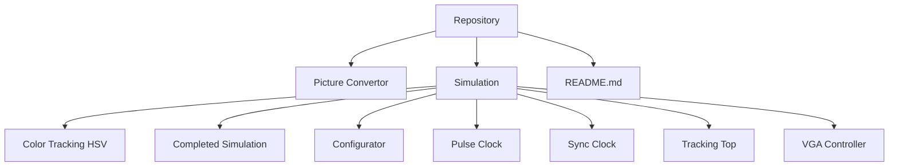
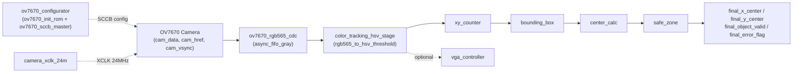
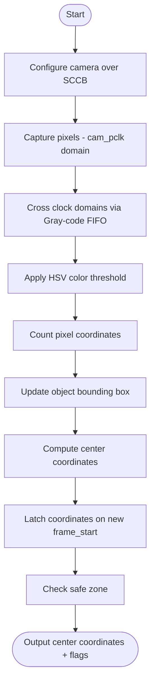
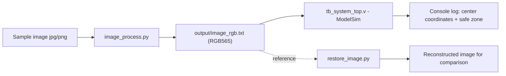

# FPGA Color Tracking

---

# 1. Overview

FPGA Color Tracking is a real-time, color-based object tracking system built around the **OV7670** camera and a **Tang Nano 9K** FPGA. The system receives an RGB565 pixel stream from the camera, applies an HSV color threshold to separate the target object from the background, then computes a bounding box and the object's center coordinates, and raises a warning whenever the object leaves a predefined Safe Zone.

The repository also includes a set of Python scripts used to generate RGB565 test image vectors for ModelSim simulation and to reconstruct an image from the simulation output for visual verification.

## Table of Contents
- [1. Overview](#1-overview)
- [2. Repository Structure](#2-repository-structure)
- [3. System Overview](#3-system-overview)
- [4. Module Index](#4-module-index)
- [5. Interface Specifications](#5-interface-specifications)
- [6. Key Parameters](#6-key-parameters)
- [7. System Workflow](#7-system-workflow)
- [8. Simulation](#8-simulation)
- [9. Notes & Known Limitations](#9-notes--known-limitations)
- [10. Conclusion](#10-conclusion)
- [11. References](#11-References)
---

# 2. Repository Structure

```text
FPGA-Color-Tracking
│
├── Picture Convertor/
│   ├── image_process.py        # Converts an image (jpg/png) -> image_rgb.txt (RGB565)
│   ├── restore_image.py        # Reconstructs an image from simulation output data
│   ├── input/                  # Sample input images
│   ├── output/                 # image_rgb.txt generated for the testbench
│   └── modelsim/
│
├── Simulation/
│   ├── Color Tracking HSV/     # color_tracking_hsv_stage.v, rgb565_to_hsv_threshold.v
│   ├── Completed Simulation/   # Full integrated RTL + testbench (system_top)
│   ├── Configurator/           # ov7670_configurator.v, ov7670_init_rom.v, ov7670_sccb_master.v
│   ├── Pulse Clock/            # camera_xclk_24m.v
│   ├── Sync Clock/             # async_fifo_gray.v, ov7670_rgb565_cdc.v
│   ├── Tracking Top/           # xy_counter.v, bounding_box.v, center_calc.v, safe_zone.v, tracking_top.v
│   └── VGA Controller/         # VGA_Controller.v
│
└── README.md
```

> **Note:** The subfolders under `Simulation` each contain a "slice" of modules used to test individual blocks in isolation. The **`Completed Simulation`** folder contains the fully integrated RTL (`system_top.v` + `tb_system_top.v`) used to simulate the whole system.



---

# 3. System Overview

The system follows this processing chain: **camera configuration → pixel capture → clock-domain crossing → HSV color filtering → coordinate counting & bounding-box tracking → center calculation → safe-zone check → (optional) VGA output**.



**Flow description:**
- **Camera configuration:** `ov7670_configurator` loads a sequence of register values from `ov7670_init_rom` over the SCCB protocol (`ov7670_sccb_master`) to put the camera into VGA 640x480, RGB565 mode.
- **Capture & CDC:** `ov7670_rgb565_cdc` combines two consecutive bytes from the `cam_pclk` domain into one RGB565 pixel, tags it with `frame_start`/`line_start` flags, and pushes it into `async_fifo_gray` (an asynchronous, Gray-code FIFO), which safely transfers the data to the `sys_clk` domain, producing `sys_pixel`, `sys_pixel_valid`, `sys_frame_start`, and `sys_line_start`.
- **HSV color filtering:** `color_tracking_hsv_stage` calls `rgb565_to_hsv_threshold`, which splits R/G/B channels from RGB565, computes H/S/V, and compares them against configured thresholds to produce `color_mask` (`1` if the pixel belongs to the target color).
- **Coordinate counting & bounding box:** `xy_counter` counts the current pixel position within the frame; `bounding_box` updates `xmin/xmax/ymin/ymax` whenever it encounters a pixel that belongs to the object.
- **Center calculation:** `center_calc` averages the bounding-box edges to produce `x_center`, `y_center`; the final center is latched every time a new `frame_start` arrives.
- **Safe zone:** `safe_zone` compares the center coordinates against a fixed 200x200-pixel safe area in the middle of the frame, and raises `error_flag` if the object leaves that area.
- **VGA (optional):** `vga_controller` generates standard 640x480@60Hz `hsync`/`vsync` signals for display purposes; `vga_rgb` is currently hard-wired to black since there is no frame buffer yet to display the processed image.

---

# 4. Module Index

| # | Module | File | Folder | Role |
|---|--------|------|--------|------|
| 1 | system_top | system_top.v | Completed Simulation | Top-level module connecting the entire system |
| 2 | camera_xclk_24m | camera_xclk_24m.v | Pulse Clock | Generates the 24MHz XCLK fed to the OV7670 camera |
| 3 | ov7670_configurator | ov7670_configurator.v | Configurator | Controls the camera configuration sequence over SCCB |
| 4 | ov7670_init_rom | ov7670_init_rom.v | Configurator | ROM holding 133 (register address, value) pairs for VGA/RGB565 camera setup |
| 5 | ov7670_sccb_master | ov7670_sccb_master.v | Configurator | Write-only SCCB/I2C master to the camera |
| 6 | ov7670_rgb565_cdc | ov7670_rgb565_cdc.v | Sync Clock | Converts the `cam_pclk` byte stream into a 16-bit pixel stream on `sys_clk` |
| 7 | async_fifo_gray | async_fifo_gray.v | Sync Clock | Asynchronous dual-clock FIFO (Gray-code pointers) used for the CDC path |
| 8 | color_tracking_hsv_stage | color_tracking_hsv_stage.v | Color Tracking HSV | Integration stage: pixel stream → HSV color mask |
| 9 | rgb565_to_hsv_threshold | rgb565_to_hsv_threshold.v | Color Tracking HSV | Splits RGB565 channels, computes H/S/V, and thresholds the color |
| 10 | xy_counter | xy_counter.v | Tracking Top | Counts the (x, y) position of the current pixel in the frame |
| 11 | bounding_box | bounding_box.v | Tracking Top | Tracks the object's bounding box (xmin, xmax, ymin, ymax) |
| 12 | center_calc | center_calc.v | Tracking Top | Computes the object's center coordinates from the bounding box |
| 13 | safe_zone | safe_zone.v | Tracking Top | Checks whether the object's center lies within the safe zone |
| 14 | tracking_top | tracking_top.v | Tracking Top | Sub-module combining xy_counter + bounding_box + center_calc + safe_zone |
| 15 | vga_controller | VGA_Controller.v | VGA Controller | Generates 640x480@60Hz VGA scan signals |
| 16 | tb_system_top | tb_system_top.v | Completed Simulation | Testbench simulating the full system, loading test images from a `.txt` file |

## 4.1 External Files & Scripts

| # | Filename | Role | Description |
|---|----------|------|--------------|
| 1 | image_process.py | Preprocessing | Reads a sample image (jpg/png) from `input/`, resizes it to 640x480, converts it to RGB565, and writes it to `output/image_rgb.txt` |
| 2 | restore_image.py | Postprocessing | Reads back simulation output data and reconstructs a viewable image for visual verification |

---

# 5. Interface Specifications

## 5.1 system_top

| # | Gate | Type | Bit-width | Description |
|---|------|------|-----------|--------------|
| 1 | sys_clk | Input | 1-bit | System clock (25MHz or 48MHz) |
| 2 | sys_rst | Input | 1-bit | System reset (active-high) |
| 3 | cam_xclk | Output | 1-bit | Clock supplied to the camera (24MHz) |
| 4 | cam_sioc | Output | 1-bit | SCCB/I2C clock |
| 5 | cam_siod | Inout | 1-bit | SCCB/I2C data |
| 6 | cam_pclk | Input | 1-bit | Pixel clock returned from the camera |
| 7 | cam_rst | Input | 1-bit | Camera reset pin |
| 8 | cam_vsync | Input | 1-bit | Frame sync |
| 9 | cam_href | Input | 1-bit | Line sync |
| 10 | cam_data | Input | 8-bit | Pixel data from the camera |
| 11 | color_sel | Input | 2-bit | Target color selection (reserved for future extension) |
| 12 | final_x_center | Output | 10-bit | X coordinate of the object's center |
| 13 | final_y_center | Output | 10-bit | Y coordinate of the object's center |
| 14 | final_object_valid | Output | 1-bit | Indicates a valid object has been detected |
| 15 | final_error_flag | Output | 1-bit | Indicates the object has left the safe zone |
| 16 | vga_hsync | Output | 1-bit | VGA horizontal sync signal |
| 17 | vga_vsync | Output | 1-bit | VGA vertical sync signal |
| 18 | vga_rgb | Output | 16-bit | RGB565 color data output to VGA (currently hard-wired to `0`) |

**Parameters:** `IMG_WIDTH = 640`, `IMG_HEIGHT = 480`

## 5.2 ov7670_rgb565_cdc

| # | Gate | Type | Bit-width | Description |
|---|------|------|-----------|--------------|
| 1 | cam_pclk | Input | 1-bit | Pixel clock, camera domain |
| 2 | cam_rst | Input | 1-bit | Reset, camera domain |
| 3 | cam_vsync | Input | 1-bit | Frame sync from the camera |
| 4 | cam_href | Input | 1-bit | Line sync from the camera |
| 5 | cam_data | Input | 8-bit | Data byte from the camera |
| 6 | cam_fifo_full | Output | 1-bit | FIFO full flag (camera domain) |
| 7 | cam_overflow_sticky | Output | 1-bit | Overflow flag (camera domain, sticky) |
| 8 | sys_clk | Input | 1-bit | System clock |
| 9 | sys_rst | Input | 1-bit | Reset, system domain |
| 10 | sys_rd_en | Input | 1-bit | FIFO read enable |
| 11 | sys_pixel | Output | 16-bit | RGB565 pixel synchronized to `sys_clk` |
| 12 | sys_pixel_valid | Output | 1-bit | Indicates a valid pixel |
| 13 | sys_frame_start | Output | 1-bit | Indicates the start of a new frame |
| 14 | sys_line_start | Output | 1-bit | Indicates the start of a new line |
| 15 | sys_fifo_empty | Output | 1-bit | FIFO empty flag (system domain) |
| 16 | sys_overflow_sticky | Output | 1-bit | Overflow flag (system domain, sticky) |

**Parameters:** `FIFO_ADDR_WIDTH` (default 5, `system_top` uses 10), `VSYNC_ACTIVE_HIGH`

## 5.3 async_fifo_gray

| # | Gate | Type | Bit-width | Description |
|---|------|------|-----------|--------------|
| 1 | wr_clk / wr_rst | Input | 1-bit | Write-side clock & reset |
| 2 | wr_en | Input | 1-bit | Write enable |
| 3 | wr_data | Input | DATA_WIDTH-bit | Data written into the FIFO |
| 4 | wr_full | Output | 1-bit | FIFO full |
| 5 | wr_overflow | Output | 1-bit | Overflow flag on write |
| 6 | rd_clk / rd_rst | Input | 1-bit | Read-side clock & reset |
| 7 | rd_en | Input | 1-bit | Read enable |
| 8 | rd_data | Output | DATA_WIDTH-bit | Data read out |
| 9 | rd_empty | Output | 1-bit | FIFO empty |
| 10 | rd_underflow | Output | 1-bit | Underflow flag on read |

**Parameters:** `DATA_WIDTH = 18` (default), `ADDR_WIDTH = 4` (default) — read/write pointers cross clock domains as Gray code through two flip-flop stages to avoid metastability.

## 5.4 rgb565_to_hsv_threshold

| # | Gate | Type | Bit-width | Description |
|---|------|------|-----------|--------------|
| 1 | clk | Input | 1-bit | System clock |
| 2 | rst | Input | 1-bit | Reset (active-high) |
| 3 | rgb565 | Input | 16-bit | Input pixel in RGB565 format |
| 4 | pixel_valid | Input | 1-bit | Indicates a valid input pixel |
| 5 | hue | Output | 8-bit | Computed Hue value |
| 6 | sat | Output | 8-bit | Computed Saturation value |
| 7 | val | Output | 8-bit | Computed Value (brightness) |
| 8 | mask | Output | 1-bit | `1` if the pixel falls within the target color threshold |
| 9 | mask_valid | Output | 1-bit | Indicates the `mask` result is valid |

**Parameters:** `H_MIN/H_MAX`, `S_MIN/S_MAX`, `V_MIN/V_MAX` — HSV thresholds defining the target color.

## 5.5 xy_counter

| # | Gate | Type | Bit-width | Description |
|---|------|------|-----------|--------------|
| 1 | clk | Input | 1-bit | System clock |
| 2 | rst | Input | 1-bit | Reset (active-high) |
| 3 | pixel_valid | Input | 1-bit | Counting tick (one per valid pixel) |
| 4 | frame_start | Input | 1-bit | Resets the counter back to (0,0) on a new frame |
| 5 | x_cnt | Output | 10-bit | Current X coordinate (0–639) |
| 6 | y_cnt | Output | 10-bit | Current Y coordinate (0–479) |

## 5.6 bounding_box

| # | Gate | Type | Bit-width | Description |
|---|------|------|-----------|--------------|
| 1 | clk / rst | Input | 1-bit | Clock & reset |
| 2 | frame_start | Input | 1-bit | Resets the bounding box to its edge values on a new frame |
| 3 | pixel_valid | Input | 1-bit | Indicates a valid pixel |
| 4 | object_pixel | Input | 1-bit | Whether the current pixel belongs to the object (= `mask`) |
| 5 | x_cnt, y_cnt | Input | 10-bit | Current pixel coordinates |
| 6 | xmin, xmax, ymin, ymax | Output | 10-bit | Object bounding-box coordinates |

## 5.7 center_calc

| # | Gate | Type | Bit-width | Description |
|---|------|------|-----------|--------------|
| 1 | xmin, xmax, ymin, ymax | Input | 10-bit | Bounding-box coordinates |
| 2 | x_center, y_center | Output | 10-bit | Center coordinates = average (`(min+max)>>1`) |

## 5.8 safe_zone

| # | Gate | Type | Bit-width | Description |
|---|------|------|-----------|--------------|
| 1 | x_center, y_center | Input | 10-bit | Object's center coordinates |
| 2 | error_flag | Output | 1-bit | `1` if the center lies outside the 200x200-pixel safe area at the middle of the frame (x: 220–420, y: 140–340) |

## 5.9 ov7670_configurator

| # | Gate | Type | Bit-width | Description |
|---|------|------|-----------|--------------|
| 1 | clk / rst | Input | 1-bit | Clock & reset |
| 2 | sioc | Output | 1-bit | SCCB clock |
| 3 | siod | Inout | 1-bit | SCCB data |
| 4 | config_done | Output | 1-bit | Indicates the full configuration sequence is complete |
| 5 | config_busy | Output | 1-bit | Indicates configuration is in progress |
| 6 | ack_error_sticky | Output | 1-bit | ACK error flag (sticky) |
| 7 | rom_index_debug | Output | 8-bit | Current ROM index (for debugging) |

**Parameters:** `CLK_HZ`, `SCCB_HZ`, `STARTUP_DELAY_CYCLES`, `INTER_WRITE_DELAY_CYCLES`, `RESET_DELAY_CYCLES`

## 5.10 vga_controller

| # | Gate | Type | Bit-width | Description |
|---|------|------|-----------|--------------|
| 1 | vga_clk | Input | 1-bit | VGA clock (standard 25.175MHz for 640x480) |
| 2 | rst | Input | 1-bit | Reset (active-high) |
| 3 | vga_hsync | Output | 1-bit | Horizontal sync signal |
| 4 | vga_vsync | Output | 1-bit | Vertical sync signal |
| 5 | vga_blank | Output | 1-bit | Blanking indicator (horizontal/vertical) |
| 6 | pixel_x, pixel_y | Output | 11-bit | Current scan coordinates on screen |

---

# 6. Key Parameters

| Parameter | Module | Default Value | Meaning |
|-----------|--------|----------------|---------|
| IMG_WIDTH / IMG_HEIGHT | system_top, tb_system_top | 640 / 480 | Standard VGA frame resolution |
| CLK_IN_HZ | camera_xclk_24m | 48,000,000 | Input clock used to derive the 24MHz camera XCLK |
| CLK_HZ / SCCB_HZ | ov7670_configurator | 48,000,000 / 100,000 | System clock and SCCB speed used during camera configuration |
| H_MIN/H_MAX, S_MIN/S_MAX, V_MIN/V_MAX | rgb565_to_hsv_threshold | H: 0–10, S: 80–255, V: 50–255 | Default HSV thresholds for detecting the target object (red hue) |
| FIFO_ADDR_WIDTH | ov7670_rgb565_cdc | 5 (default) / 10 (used in system_top) | CDC FIFO depth, increased in simulation to avoid overflow |
| Safe Zone bounds | safe_zone | x: 220–420, y: 140–340 | 200x200-pixel safe area at the center of the frame |

---

# 7. System Workflow

## 7.1 Configuration Stage

- `camera_xclk_24m` supplies a 24MHz clock to the OV7670 camera (divided by 2 from a 48MHz `sys_clk`, or passed through if `sys_clk` is already 24MHz).
- `ov7670_configurator` sequentially reads 133 (register address, value) pairs from `ov7670_init_rom` and writes each pair through `ov7670_sccb_master` (SCCB/I2C protocol, write address `8'h42`) to put the camera into VGA 640x480, RGB565 mode with scaling disabled.
- The `config_done` flag is raised once all 133 commands have been written.

## 7.2 Capture & Clock Domain Crossing

- The camera outputs pixels in the `cam_pclk` domain; `ov7670_rgb565_cdc` combines two consecutive bytes into one 16-bit RGB565 pixel, attaches `frame_start`/`line_start` flags, and writes them into `async_fifo_gray`.
- `async_fifo_gray` uses Gray-code pointers passed through two flip-flop stages to safely transfer data to the `sys_clk` domain, avoiding metastability between two unrelated clock domains.

## 7.3 HSV Color Filtering

- `color_tracking_hsv_stage` receives a valid `sys_pixel` and calls `rgb565_to_hsv_threshold`, which splits the R8/G8/B8 channels from RGB565, computes Max/Min/Delta through a pipeline, derives H/S/V, and compares them against the configured thresholds to output `color_mask`.

## 7.4 Tracking (XY Counter → Bounding Box → Center)

- `xy_counter` counts the (x, y) coordinate for each valid pixel, resetting to (0,0) whenever a new `frame_start` occurs.
- `bounding_box` progressively expands the box (`xmin/xmax/ymin/ymax`) each time it sees a pixel with `object_pixel = 1`.
- `center_calc` computes the center coordinate as the average of the bounding-box edges.
- `system_top` latches the final center coordinates into registers every time a new `frame_start` arrives, and sets `final_object_valid` if the bounding box is valid (`xmax >= xmin`, `ymax >= ymin`, `xmax != 0`).

## 7.5 Safe Zone Check & Output

- `safe_zone` compares the latched center coordinates against the 200x200-pixel safe area (x: 220–420, y: 140–340); if the object is outside it, `final_error_flag` is raised.
- The final results (`final_x_center`, `final_y_center`, `final_object_valid`, `final_error_flag`) are output from `system_top` for display or further control logic.

## 7.6 VGA Output (Optional)

- `vga_controller` generates standard 640x480@60Hz `hsync`/`vsync` signals along with scan coordinates `pixel_x`/`pixel_y`; currently `vga_rgb` is hard-wired to `0` (black) because the system does not yet include a frame buffer to display the processed image.



---

# 8. Simulation

## 8.1 Testbench Workflow (`tb_system_top.v`)

1. Initialize `sys_clk` (50MHz, 20ns period) and `cam_pclk` (~24MHz, ~41.6ns period).
2. Read the file `input/image_rgb.txt` (hex format, one RGB565 pixel per line) into the `image_mem` array using `$readmemh`. This file must contain exactly `640 x 480 = 307,200` lines.
3. After releasing reset, the testbench streams one frame (Frame 1): for each pixel, it drives `cam_href = 1` and pushes the high byte, then the low byte of the pixel, onto `cam_data` on each falling edge of `cam_pclk`.
4. A second, shortened frame (Frame 2) is generated solely to trigger a new `frame_start` pulse, which latches the center coordinates computed from Frame 1 onto the `final_*` output ports.
5. The console prints the final result: the center coordinates (`final_x_center`, `final_y_center`) and the safe-zone status (`final_error_flag`) if `final_object_valid = 1`; otherwise, it prints "KHONG TIM THAY VAT THE!".

**Example**   
**Case 1**: If the object is in the safe zone  

  

  

**Case 2**: If the object is not found

  

  

## 8.2 Picture Converter Scripts

- **`image_process.py`**: reads a sample image (jpg/png) from `Picture Convertor/input/`, resizes it to exactly 640x480, converts each pixel to RGB565, and writes the result to `Picture Convertor/output/image_rgb.txt` — the same file loaded by `tb_system_top.v`.
- **`restore_image.py`**: reads back simulation output (or RGB565 image data) and reconstructs a viewable image for visual verification.



---

# 9. Notes & Known Limitations

- `vga_rgb` in `system_top` is currently hard-wired to `16'h0000` (black) because the system does not yet have a frame buffer to store and display the processed image — this is the "optional display feature for later" noted in the code's comments.
- `camera_xclk_24m` only supports `CLK_IN_HZ = 24 MHz` (pass-through) or `48 MHz` (divide-by-2); if the actual board clock differs (e.g., the Tang Nano 9K's 27MHz), a Gowin PLL is needed to generate 24MHz or 48MHz before feeding this module.
- The `color_sel` port on `system_top` is currently unused in the processing logic — it is reserved for future dynamic target-color selection (the HSV thresholds are currently fixed via parameters).
- The `ack_error_sticky` flag on `ov7670_sccb_master`/`ov7670_configurator` is informational only (a sticky flag) and does not automatically retry a failed camera write.
- `FIFO_ADDR_WIDTH` is increased to 10 (instead of the default 5) in `system_top` to deepen the FIFO and avoid overflow during simulation.
- The testbench requires `input/image_rgb.txt` to contain exactly 307,200 lines (640x480); if it has fewer, `$readmemh` will read incomplete data or the simulation will fail.

---

# 10. Conclusion

The FPGA Color Tracking system implements a complete real-time, color-based object-tracking pipeline: from camera configuration, pixel capture, and clock-domain synchronization, through HSV color thresholding, to bounding-box tracking, center calculation, and safe-zone checking. The clear modular architecture — each RTL block handling one independent function, testable on its own in the `Simulation/*` subfolders — makes it convenient to verify each part before integrating the full system through `system_top.v`. VGA image output remains a future development direction, requiring a frame buffer to be added in order to display the processed result on an actual screen.

---

# 11. References

* **[1] Gowin Semiconductor Corp.**, *"GW1NR Series of FPGA Products Data Sheet"*, Guangzhou, China, DS117-1.5E, 2024.  
* **[2] OmniVision Technologies, Inc.**, *"OV7670/OV7171 CMOS VGA Color Digital Camera Implementation Guide"*, Santa Clara, CA, USA, Version 1.4, 2006.  
* **[3] C. E. Cummings**, *"Simulation and Synthesis Techniques for Asynchronous FIFO Design"*, in *Proceedings of Synopsys Users Group (SNUG) Conference*, San Jose, CA, USA, 2002, pp. 1–23.  
* **[4] J. Yuen**, *"Clock Domain Crossing (CDC) Design & Verification Techniques Using SystemVerilog"*, *IEEE Transactions on Very Large Scale Integration (VLSI) Systems*, 2019.
* **[5] A. R. Smith**, *"Color Gamut Transform Pairs"*, in *Proceedings of the 5th Annual Conference on Computer Graphics and Interactive Techniques (SIGGRAPH '78)*, Atlanta, GA, USA, 1978, pp. 12–19.  
* **[6] R. C. Gonzalez and R. E. Woods**, *Digital Image Processing*, 4th ed. Upper Saddle River, NJ, USA: Pearson, 2018.  
* **[7] Video Electronics Standards Association (VESA)**, *"VGA Signal Timing Standard for 640x480 at 60Hz"*, San Jose, CA, USA, Reference Guidelines, 2001.  
  

---

**End Report**
